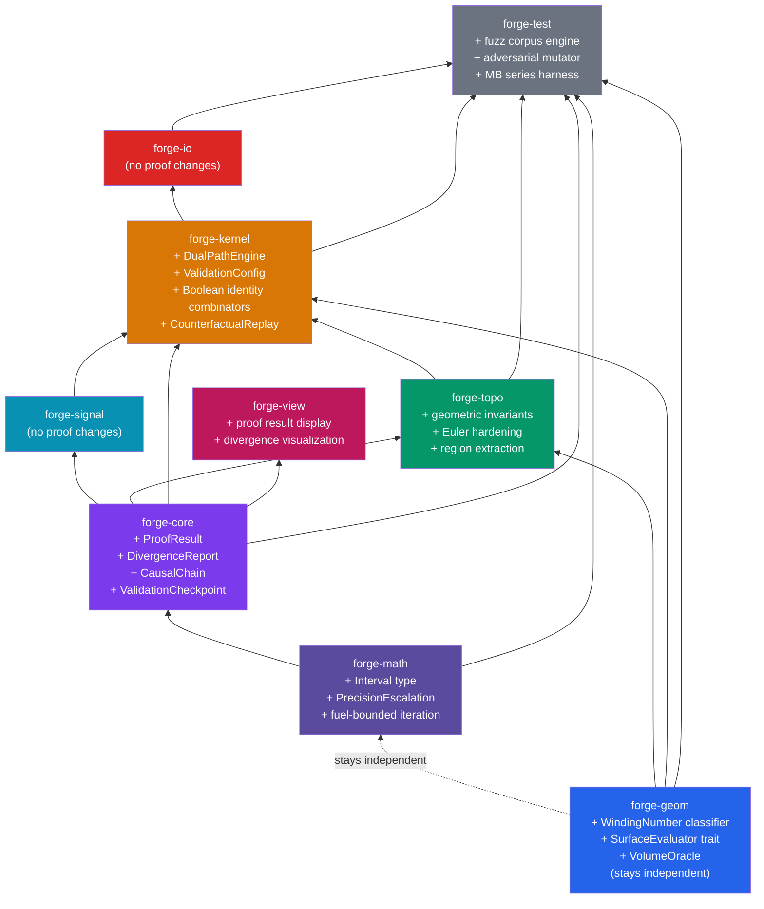

# Proof System Dependency Roadmap

What needs to change in the crate graph to fully implement [PROOF_SYSTEM.md](file:///Users/spenstar/Documents/programming/Forge/PROOF_SYSTEM.md), and what's already in the right place.

---

## Target Dependency Graph (After Full Implementation)

> [!NOTE]
> `forge-geom` stays independent (math-only). The proof system respects this — winding number and volume oracle live in geom as pure solvers, and the kernel wraps results in policy/proof context.

---

## Phase P0 — Topological Invariant Fortress

**Crates:** `forge-topo` + `forge-kernel`

### What needs to change

| Crate | Change | Status |
|-------|--------|--------|
| `forge-topo` | **Geometric invariant extensions** in `integrity/validate.rs` — zero-area face, zero-length edge, signed volume, degenerate loop detection | 🔴 New |
| `forge-topo` | **Generalized Euler** — genus-aware `V-E+F=2(S-G)+R` validation, per-solid decomposition | 🔴 New |
| `forge-topo` | **Orientation canonicalization** — post-commit normal verification via signed-volume test | 🔴 New |
| `forge-topo` | **Non-manifold edge detection** — edge valence check, T-junction detection | 🔴 New |
| `forge-kernel` | **`ValidationConfig`** — checkpoint enum, geometric toggle, entity limit, fuel budget | 🔴 New |
| `forge-kernel` | **`ValidationResult`** embedded in `OperationResult<T>` | 🔴 New |
| `forge-core` | **`ValidationCheckpoint`** enum (PostCommit, PostBoolean, PostFeature, PostImport, OnDemand) | 🔴 New |

### What's already fine

- ✅ `validate_topology()` in `forge-topo` — twin reciprocity, previous consistency, vertex continuity, loop closure, per-shell Euler already exist
- ✅ `OperationResult<T>` envelope — proof results slot in naturally
- ✅ `ToleranceConfig` — area/edge thresholds can be added here
- ✅ Generational handles via `thunderdome` — P6 doctrine satisfied
- ✅ `forge-topo` depends on `forge-geom` — can call geometry solvers for area/volume computation

### Dependency impact: **None.** Current deps are sufficient.

---

## Phase P1 — Dual-Path Verification Engine

**Crates:** `forge-kernel` + `forge-topo` + `forge-geom`

### What needs to change

| Crate | Change | Status |
|-------|--------|--------|
| `forge-geom` | **Winding number classifier** — signed solid-angle summation, BVH-accelerated, independent from ray casting | 🔴 New |
| `forge-geom` | **`SurfaceEvaluator` trait** — dispatches area/volume/solid-angle computation (NR-1 readiness) | 🔴 New |
| `forge-kernel` | **`DualPathResult`** / **`PathAgreement`** / **`DisagreementContext`** structs | 🔴 New |
| `forge-kernel` | **Post-Boolean cross-check wiring** — classify centroids against pre-Boolean operands | 🔴 New |
| `forge-kernel` | **Disagreement protocol** — escalation on FundamentalDisagreement, logging on BoundaryDisagreement | 🔴 New |
| `forge-core` | **`ProofFailure`** enum — DualPathMismatch, IrreconcilableDualPath variants | 🔴 New |

### What's already fine

- ✅ `classify_point_in_solid` in `forge-topo` — ray-casting path already works
- ✅ `BvhNode` in `forge-geom` — BVH acceleration infrastructure exists
- ✅ `TracedDecision::NearBoundary` tier — boundary disagreements slot into existing trace system
- ✅ `forge-geom` is independent — winding number is a pure solver, no policy types needed

### Dependency impact

> [!IMPORTANT]
> `DualPathResult` references `FaceId` (from `forge-topo`) + `Lineage` (from `forge-topo`). These types must live in `forge-kernel` (which depends on both `forge-topo` and `forge-geom`). The winding number solver in `forge-geom` sees only `[f64; 3]` arrays + `&dyn GeometrySource`, never topology handles. **No new crate deps required.**

---

## Phase P2 — Redundant Numerical Modes

**Crates:** `forge-math` + `forge-geom` + `forge-kernel`

### What needs to change

| Crate | Change | Status |
|-------|--------|--------|
| `forge-math` | **`Interval` type** — lower/upper bounds, tracked accumulated error | 🔴 New |
| `forge-math` | **Interval versions of basic ops** — add, sub, mul, div, sqrt with bound propagation | 🔴 New |
| `forge-math` | **Interval sign → `CertifiedTriSign`** pipeline — interval doesn't contain zero → certified | 🔴 New |
| `forge-math` | **`PrecisionMode`** enum — Float64 / Interval / Rational | 🔴 New |
| `forge-math` | **`PrecisionEscalation`** struct — resolved_at, float_agreed, interval_width | 🔴 New |
| `forge-kernel` | **Precision escalation pipeline** — float→interval→rational auto-escalation in `ModelingContext` | 🔴 New |
| `forge-kernel` | **`DivergenceReport`** — scan DecisionLog for float/exact disagreements, classify topology impact | 🔴 New |
| `forge-kernel` | **Scale-invariant precision guards** — local coordinate space transforms, condition number estimation | 🔴 New |
| `forge-core` | **`PrecisionEscalation`** attached to `TracedDecision` — records which precision resolved the decision | 🔴 New |

### What's already fine

- ✅ `CertifiedTriSign` in `forge-math` — the exact-predicate end of the pipeline exists
- ✅ `orient2d` / `orient3d` — exact predicates exist, interval versions are additive
- ✅ `Rational` type in `forge-math` — rational arithmetic fallback exists
- ✅ `DecisionLog` — precision escalation data slots into existing trace infrastructure
- ✅ `forge-geom` stays independent — precision escalation is driven by the kernel calling geom solvers at different precisions, not by geom knowing about the pipeline

### Dependency impact

> [!IMPORTANT]
> **`PrecisionEscalation` ownership question.** The struct is defined in the proof system as carrying `PrecisionMode` (which lives in `forge-math`). But it's attached to `TracedDecision` (which lives in `forge-core`). Since `forge-core` depends on `forge-math`, this works: define `PrecisionMode` and `PrecisionEscalation` in `forge-math`, import into `forge-core` for `TracedDecision`. **No new crate deps required.**

---

## Phase P3 — Causal Replay & Witness System

**Crates:** `forge-core` + `forge-topo` + `forge-kernel`

### What needs to change

| Crate | Change | Status |
|-------|--------|--------|
| `forge-core` | **`CausalChain`** / **`CausalStep`** / **`ChainSummary`** structs | 🔴 New |
| `forge-core` | **`DecisionDelta`** — diff between two `DecisionLog` snapshots | 🔴 New |
| `forge-core` | **`CounterfactualResult`** — topology hash delta from replayed-with-override | 🔴 New |
| `forge-topo` | **N-ring region extraction** — extract minimal sub-mesh around a problematic entity | 🔴 New |
| `forge-topo` | **Boundary sealing** — make extracted region a valid closed mesh | 🔴 New |
| `forge-kernel` | **Causal chain reconstruction** — walk `Lineage` + `DecisionLog` to build `CausalChain` | 🔴 New |
| `forge-kernel` | **Witness-based replay** — `replay_decision(id, override)` → `CounterfactualResult` | 🔴 New |
| `forge-kernel` | **Semantic summarization** — compress raw entity deltas into agent-consumable narratives | 🔴 New |

### What's already fine

- ✅ `ReplayLog` in `forge-topo` — records operations with pre/post hashes
- ✅ `DecisionLog` in `forge-core` — span-based decision traces with margins
- ✅ `Lineage` + `OpSignature` in `forge-topo` — Merkle DAG ancestry tracking exists
- ✅ `TraceSummary::diff()` in `forge-core` — diffing infrastructure exists, `DecisionDelta` extends it
- ✅ `EntityRef` in `forge-core` — crate-neutral entity reference, used in causal chains without importing topo handles

### Dependency impact

> [!IMPORTANT]
> **`CausalChain` references `OpSignature` (from `forge-topo`) and `TracedDecision` (from `forge-core`).** If `CausalChain` lives in `forge-core`, it can't reference `OpSignature`. Two options:
> 1. Put `CausalChain` in `forge-kernel` (can see everything) — simplest
> 2. Move `OpSignature`'s serializable portion into `forge-core` as a string/struct
>
> **Recommend option 1.** `CausalChain` is an application-level construct — it belongs in `forge-kernel`.

---

## Phase P4 — Self-Consistency Fuzzing Engine

**Crates:** `forge-test` + `forge-kernel`

### What needs to change

| Crate | Change | Status |
|-------|--------|--------|
| `forge-test` | **Boolean identity combinators** — `assert_union_cancellation`, `assert_commutative`, etc. | 🔴 New |
| `forge-test` | **Transform invariance proofs** — `assert_transform_invariance` | 🔴 New |
| `forge-test` | **Adversarial mutation engine** — genetic algorithm, ULP perturbation, near-parallel plane generation | 🔴 New |
| `forge-test` | **Fuzz corpus management** — monotonic growth, pinned regression cases, statistical tracking | 🔴 New |
| `forge-test` | **Per-step Euler checkpoint** — validation hooks in operation chains | 🔴 New |
| `forge-geom` | **`VolumeOracle`** — signed-volume computation via divergence theorem, trait-dispatched (NR-3) | 🔴 New |
| `forge-kernel` | **`ProofResult`** return type — confidence metrics, not just pass/fail | 🔴 New |
| `forge-core` | **`ProofResult`** struct — numeric confidence, margin, coverage percentage | 🔴 New |

### What's already fine

- ✅ `generators.rs` in `forge-test` — random polyhedron generators exist (Tier 1 of P4.4)
- ✅ `harness.rs` in `forge-test` — self-consistency harness structure exists
- ✅ `fixtures.rs` in `forge-test` — reusable test fixtures
- ✅ `BooleanInput` / `BooleanOp` / `execute_boolean` — Boolean API is stable
- ✅ `TopologyState` hashing — topology fingerprinting exists for comparison

### Dependency impact

> [!WARNING]
> **`forge-test` needs `forge-geom` for `VolumeOracle`.** Already has this dep. But the volume oracle also needs `SurfaceEvaluator` (from geom) — which should be defined in `forge-geom` and implemented per-surface-type. The `Plane` implementor goes in `forge-geom`. **No new crate deps required.**

---

## Per-Crate Change Summary

| Crate | Current State | What Changes | New Deps? |
|-------|--------------|--------------|-----------|
| **forge-math** | Exact predicates, rational arithmetic | + `Interval` type, + `PrecisionMode/Escalation`, + fuel-bounded iteration protocol | ❌ None |
| **forge-core** | Error taxonomy, DecisionLog, OperationResult | + `ValidationCheckpoint`, + `ProofFailure`, + `ProofResult`, + `DecisionDelta`, + `PrecisionEscalation` on TracedDecision | ❌ None |
| **forge-geom** | Plane, BSP, BVH, ray ops | + Winding number classifier, + `SurfaceEvaluator` trait, + `VolumeOracle` | ❌ Stays math-only |
| **forge-signal** | Reactive graph | **No changes** | ❌ None |
| **forge-topo** | Arena, handles, Euler ops, lineage | + Geometric invariants, + generalized Euler, + orientation proof, + non-manifold detection, + region extraction | ❌ None |
| **forge-kernel** | ModelingContext, features, booleans | + `ValidationConfig`, + `DualPathEngine`, + causal chain reconstruction, + counterfactual replay, + identity combinators, + divergence reporting | ❌ None |
| **forge-io** | Save/load | **No changes** | ❌ None |
| **forge-view** | TraceStore, viewer | + Proof result display, + divergence visualization | ❌ None |
| **forge-test** | Generators, harness, fixtures | + Fuzz corpus engine, + adversarial mutator, + MB series (50 tests), + identity combinators, + per-step checkpoints | ❌ None |

---

## The Topo Trace Coupling Question

The proof system **deepens** the `forge-topo` → `forge-core` coupling:
- P0 invariant results get embedded in `OperationResult<T>`
- P3 region extraction uses `EntityRef` from `forge-core`
- P3 causal chains walk `Lineage` (topo) + `DecisionLog` (core) together

From first principles, this is the right design — `forge-core` defines the *language* of decisions and results, and `forge-topo` *speaks* that language because it's where structural truth lives. The current coupling in `apply_op` (building full `TracedDecision`/`DecisionLog`) is actually **forward-compatible** with the proof system's needs: every Euler op producing a trace is exactly what P3 causal chain reconstruction requires.

> [!TIP]
> **The current `apply_op` trace coupling isn't a violation — it's an early implementation of P3.** The only cleanup would be separating the "Euler op result" semantics from the "degeneracy decision" semantics — don't use `DecisionContext::Degeneracy` as a log message carrier for routine Euler ops.

---

## Bottom Line

**No new Cargo.toml dependencies are needed.** The current crate graph supports the full proof system. The work is all additive — new types, new traits, new test infrastructure. The structural boundaries you've drawn are correct for the proof system's requirements.
