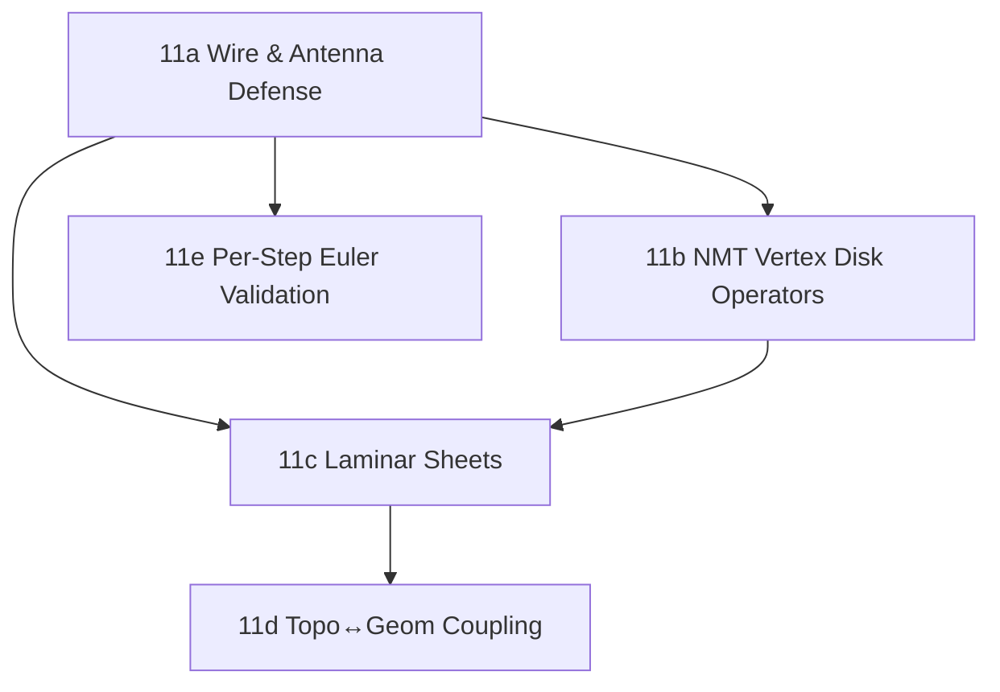

# Pre-Boolean Feature Roadmap

This document provides the **strictly ordered** sequence of work required to build the Forge geometric kernel up to the point where Boolean operations can be safely introduced.

It weaves together the Proof System (`P-` milestones) and the Kernel Foundation (`K-` milestones) into a single dependency-respecting path. Booleans are mathematically violent; if we attempt them before this foundation is solid, we will be debugging Boolean logic and structural corruption simultaneously.

**Estimated total: ~65-74 PRs across 7 phases.**

---

## 🏗️ Phase 1: Observability & Causality Foundation

_Before we can trust geometry, we must be able to observe, trace, and replay decisions._

### 1. Tracing Pipeline — DecisionSink Collection [K-1]

Thread `DecisionSink` into every predicate and topology operator so that every choice is recorded with its scalar margin. The production sink is `ModelingContext`, which collects decisions and gets threaded through `OperationScope`. `NullSink` exists in `forge-core` for unit-testing but is banned in production code.

- **Difficulty:** ✅ Done | **Size:** ~2-3 PRs
- **Test:** Run `make_block`, assert `DecisionLog` contains entries with `DecisionKind::NearBoundary` and `margin() > 0.0`.

### 2. Lineage DAG Wiring [P3.3]

Every primitive operation must generate a Merkle causal chain linking the resulting topology back to the original `feature_id`.

- **Difficulty:** ✅ Done | **Size:** ~3-4 PRs
- **Test:** Run `make_block`, query `LineageStore` for a face, assert its `Lineage::Root` contains the exact `feature_id` from `OperationScope`.

### 3. Pipeline Infrastructure — Middleware-Chain State Threading [K-6]

Deterministic parametric chains (`MakeBox → Fillet → Cut → Result`) where the `SolidEnvelope` output of step N feeds into step N+1, accumulating unified `DecisionLog` and `LineageStore`. Each `SolidEnvelope` carries both topology and geometry as a single immutable unit.

The pipeline is implemented as `FeaturePipeline::execute(feature, inputs, config)` — a single entry point with 11 internal stages:

1. **Resolve config** — cascade global → feature overrides
2. **Pre-validate policies** — fail-fast before mutation
3. **Pipeline fingerprint** — configurable `FingerprintDetail` (Standard/Full)
4. **Conditioning** — `OperationSpace` analyze → transform (pipeline-managed)
5. **Parse + validate** — typed inputs with ownership transfer
6. **Execute** — feature business logic with `OperationScope`
7. **RAII restore** — `ConditioningGuard` (panic-safe)
8. **Hash output** — topology structural hash
9. **Finalize** — drain `ModelingContext` → envelope
10. **Invariants** — post-execution validation
11. **Audit** — trace emission (None/Summary/Full)

```rust
FeaturePipeline::execute(&feature, inputs, &session_config)?;
// Returns OperationResult<SolidEnvelope> with full audit trail
```

This unifies Items 1 (DecisionSink via `ModelingContext`), 2 (Lineage), and 3 (Pipeline) into a single composable execution model.

- **Difficulty:** ✅ Done | **Size:** ~2 PRs
- **Test:** Evaluate a 3-step pipeline twice, assert identical `full_fingerprint()` values and trace span counts. Assert `DecisionLog` contains entries from all three steps. Assert `LineageStore` links each output face back through the chain.

### 4. Replay Determinism & Serialization Round-Trip [P3.5-lite]

Serialize a `SolidEnvelope` (topology + geometry) to bytes, deserialize, and assert bit-identical result. Also serialize a `ReplayLog` (via `forge-topo`'s `MutableDraft`), replay in a fresh context, assert identical `SolidEnvelope`.

Determinism verification uses `SolidEnvelope::full_fingerprint()` which hashes topology arenas, vertex positions (f64 bit-exact), and face plane normals + offsets. The harness (`assert_deterministic`, `assert_deterministic_n`) diagnoses whether divergence is structural (topology) or geometric (vertex positions / face planes).

- **Difficulty:** ✅ Done | **Size:** ~1 PR
- **Test:** Generate a cube, serialize, deserialize, assert `full_fingerprint()` is identical.

---

## 🧮 Phase 2: Geometric & Mathematical Truth

_Before we mutate topology, ensure our math stops floating-point lies and our geometry is real._

### 5. Volume Oracle [P4.3]

Divergence theorem volume computation for polyhedra. Promoted to a first-class harness oracle (`volume_of(envelope) -> Result<f64, OracleError>`) with formal contract: preconditions (closed 2-manifold, consistent orientation), failure classification (`OpenShell`, `InconsistentOrientation`), and bounded-error comparison (never `==` on f64).

Also implements mass-property centroid via tetrahedralization against reference point — not vertex averaging.

Oracle architecture: thin precondition wrappers in `forge-kernel/integration_tests/harness/oracles.rs` delegating pure math to `forge-geom` (divergence theorem) and topology walking to `forge-kernel/geometry/logic/measurements.rs`. No ad-hoc math in test code.

- **Difficulty:** ✅ Done | **Size:** ~2 PRs | **Status:** ✅ Done — oracle + 12 adversarial tests
- **Test:** Analytical volume (block, cube), cubic scaling, height linearity, translation invariance, centroid at origin/offset, tetrahedron centroid exact vertex average, complex solid invariance, needle-thin box (`rel_tol=1e-10`), giant cube ($1000^3$), all-primitives-positive. Oracle precondition rejects open shells and non-manifold edges (`radial_valence ≠ 2`).

### 6. Face Normal Computation

Every face needs a computable, consistently outward-pointing normal. Correctness defined by inside/outside classification (not centroid heuristic): for face point `p` with normal `n`, assert `classify_point_in_solid(p + εn) == Outside` and `classify_point_in_solid(p - εn) == Inside`. Works for convex and concave geometry.

Classification algorithm lives in `forge-spatial/operations/classify/normal_orientation.rs`. Oracle in `forge-kernel` is a thin precondition wrapper that delegates entirely to `classify_face_normal_orientation`.

- **Difficulty:** ✅ Done | **Size:** ~1 PR | **Status:** ✅ Done — oracle + 12 adversarial tests
- **Test:** All 7 primitives (cube 6, tet 4, dodecahedron 12, hex prism 8, pyramid 5, wedge, tri prism 5). Unit magnitude (`‖n‖ ≈ 1.0`). Idempotency. Offset cube ($10^6$ coordinates). Large cube (size 1000, ε=1.0). Small cube (size 0.001, ε=1e-5).

### 7. Geometry Completeness — Surface Binding [K-4]

Full 3D surface geometry for every face. Consolidates the dual `planes` / `surfaces` layers: primitive constructors emit `SurfaceData::plane(...)` into `GeometryStore.surfaces` alongside the existing `planes` entry, making `planes` a legacy fast-path. Validators check `surfaces` (the `SurfaceData`-agnostic path), so when cylinders/spheres arrive, zero validator changes are needed.

**7a. Surface Emission in Primitives**: update `build_halfedge_mesh` to emit `SurfaceData::plane(normal, offset)` into `geometry.surfaces` for each face (alongside existing `geometry.planes` write). This dual-emit preserves backward compatibility while establishing the forward-looking surface layer.

**7b. Surface Completeness Validator**: every face has a `SurfaceData` entry in `geometry.surfaces` → `MissingSurfaceBinding { face_index }`

**7c. Vertex-on-Surface Validator**: for each face, evaluate surface implicit equation at each vertex. For `Plane`: `signed_distance`. For `Sphere`: `|‖v-c‖ - r|`. For `Cylinder`: distance from axis minus radius. Generic: `‖v - surface.point_at(closest_uv)‖` (Phase 4+). → `GeometricDeviation { vertex_index, face_index, distance, threshold, surface_kind }`

**7d. Edge-on-Surface Validator**: sample edge midpoints, verify they lie on both adjacent faces' surfaces (catches warped edges with correct endpoints). For lines+planes this is always true by linearity; for curves, sample at multiple `t` values (Phase 4+). → `EdgeSurfaceDeviation { edge_index, face_index, max_deviation, threshold }`

- **Difficulty:** 🟡 Medium | **Size:** ~3 PRs | **Status:** ⏳ Deferred to Phase 2b — `GeometryStore` fields exist, emission + validators needed
- **Test:** All primitives pass completeness. Missing surface → `MissingSurfaceBinding`. Vertex 10.0 off plane → `GeometricDeviation`. Tolerance boundary: `0.5×tol` passes, `2×tol` fails. Monotonicity: tightening tolerance never decreases failures.

### 8. Edge-Curve Association

Every edge must have an associated `CurveGeom` stored in `GeometryStore.curves`. BSP generators currently populate `planes` and `positions` only — this item adds `CurveKind::Line` emission during primitive construction and validators for curve-topology consistency.

**8a. Curve Emission in Primitives**: update `build_halfedge_mesh` to compute `CurveKind::Line { origin, direction }` from each edge's vertex positions and store in `GeometryStore.curves`.

**8b. Curve Completeness Validator**: every edge has a `CurveGeom` → `MissingCurveBinding`. Endpoint positions match within tolerance → `CurveMismatch { deviation }`. Both half-edges of a shared edge reference the same underlying curve.

- **Difficulty:** 🟡 Medium | **Size:** ~2-3 PRs | **Status:** ⏳ Deferred to Phase 2b — types exist in `forge-geom`, emission + validators needed
- **Test:** All primitives pass. Missing curve → `MissingCurveBinding`. Corrupted origin → `CurveMismatch` with deviation reported. Shared-edge consistency.

### 9. Geometric Invariants [P0.1]

Degenerate geometry detection + shell closure validation. Five geometry-dependent validators + 28 adversarial integration tests following the `VALIDATOR_QA.md` poison-test contract.

| Validator         | InvariantId                   | Tests | Status  |
| :---------------- | :---------------------------- | :---: | :------ |
| Zero-length edge  | `NoZeroLengthEdges`           |   5   | ✅ Done |
| Zero-area face    | `NoZeroAreaFaces`             |   6   | ✅ Done |
| Inside-out shell  | `NoInsideOutShells`           |   4   | ✅ Done |
| Loop orientation  | `LoopOrientationConsistency`  |   7   | ✅ Done |
| Shell orientation | `ShellOrientationConsistency` |   6   | ✅ Done |

Includes adversarial cases: collinear slivers, numerical jitter near-zero, NMT edge-sharing, coincident-but-distinct vertices, sub-tolerance boundaries.

**9a. Self-Intersection Detection**: Validator `ValidateNoSelfIntersection` detects face-face penetration within a single solid. Requires spatial indexing (Item 15) for production O(n log n) broad-phase. BSP convex primitives are self-intersection-free by construction.

- **Difficulty:** ✅ Done (9) + 🟡 Medium (9a) | **Size:** ~1+ PR for 9a | **Status:** Item 9 ✅ Done | Item 9a ⏳ Deferred to Phase 3+ (requires spatial index)
- **Test (9):** 28 integration tests, all passing. **Test (9a):** All primitives pass. Manually create intersecting faces → detected.

### 10. Precision Escalation Pipeline [P2.2] ✅

Shewchuk adaptive cascade for exact predicate signs: Float64 → ExpansionB → ExpansionC. `PrecisionEscalation` metadata records: what triggered escalation, what bounds were exceeded, what method resolved it. `PrecisionBudget` enforces bit-length limits.

**Accepted strategy:** Shewchuk adaptive arithmetic expansions are the precision escalation layer between fast Float64 and deferred Rational/symbolic construction. This is the industry standard approach (used by CGAL, Triangle, Tetgen). The original roadmap described Float→Interval→Rational; the accepted architecture is Float→Expansion (exact sign), with Rational deferred to Phase 4 intersection/closest-point construction.

**Current layer model:**
| Layer | Scope | Status |
| :--- | :--- | :--- |
| Float64 fast path | All predicates | ✅ Done |
| Shewchuk expansion exact sign | `orient2d`, `orient3d`, `incircle`, `in_sphere` | ✅ Done |
| Rational/symbolic construction | Intersection, closest-point (Phase 4) | ⏳ Deferred |

- **Difficulty:** 🟡 Medium | **Size:** ~2 PRs | **Status:** ✅ Done — predicates + expansions implemented, 27+ predicate tests + 3 divergence detection tests passing
- **Test:** `orient3d` with near-coplanar input where f64 sign is wrong → assert expansion corrects, `float_agreed == false`. `orient3d` at `1e12` coordinates → same sign as centered version. 100× determinism.

### 10.1. Tolerance Policy System

`ToleranceProvider` trait with per-entity tolerances (`vertex_tolerance`, `edge_tolerance`, `global_default`, `geometry_epsilon`) — done. `FlatToleranceProvider` for planar Phase 1–2 fast path. All spatial validators use `ToleranceProvider` instead of hardcoded constants.

**Deferred to Item 18 (Scale-Invariant Coordinates):** Full `ComparisonPolicy` with relative + absolute tolerance and algorithm tagging. Relative tolerance design depends on whether local coordinate transforms normalize scale before comparison. Building it now risks committing to an API that doesn't fit the final scale-invariance strategy.

- **Difficulty:** 🟡 Medium | **Size:** ~1 PR | **Status:** ✅ Partial — `ToleranceProvider` + `geometry_epsilon()` done. `ComparisonPolicy` deferred to Item 18.

### 10.2. Sliver Face Invariant [deferred]

Wire `analyze_slivers` as a hard invariant (`InvariantId::NoSliverFaces`) through the spatial dispatch system. Requires `ComparisonPolicy` to define the "what aspect ratio is too thin?" threshold — currently `analyze_slivers` is a diagnostic report, not a committed invariant. Blocked on Item 10.1 `ComparisonPolicy` completion.

- **Difficulty:** 🟢 Easy | **Size:** ~0.5 PR | **Status:** ⏳ Deferred (blocked on ComparisonPolicy)

### 10.5. B-Rep Validator Hardening [K-4.5]

_Comprehensive structural validators that catch operator corruption at commit time. Discovered via an architectural audit of all boundary editing operators (join_faces, KEML, KFMRH, MEKL, MFKRH, batch constructors) which found 10 confirmed bugs including outer loop hijacking, vertex radial isolation, inside-out faces, and dangling shell pointers._

**Batch 1 — Pure Pointer Checks (8 validators, ✅ Done)**
`ValidateNoDanglingHalfEdgeRefs`, `ValidateGenerationalIdFreshness`, `ValidateBidirectionalLinks`, `ValidateFaceHasAtLeastOneLoop`, `ValidateLoopMinimumCardinality`, `ValidateNoDuplicateCoedgesInLoop`, `ValidateFaceLoopMembershipComplete`, `ValidateRadialCycleUniqueness`

**Batch 2 — Ownership & Orphan Tracking (5 validators, ✅ Done)**
`ValidateSingleOwnerPerLoop`, `ValidateNoOrphanHalfEdges`, `ValidateAcyclicContainment`, `ValidateEdgeEndpointsMatchLoopVertices`, `ValidateInnerOuterLoopConsistency`

**Batch 3 — Face & Shell Adjacency (6 validators, ✅ Done)**
`ValidateFaceAdjacencyConsistency`, `ValidateNoFaceWithBrokenBoundary`, `ValidateShellWatertightness`, `ValidateBoundaryEdgesLaminarOnly`, `ValidateRadialNeighborConsistency`, `ValidateNoBrokenRadialSplices`

**Batch 4 — Vertex Disk Completeness & Operator Hardening (4 validators + 1 operator fix, ✅ Done)**
Catches bugs in batch face constructors (MFFV/MFIS/MLIFV) and NMT operators.

| Item                                | Status  | Catches                             |
| :---------------------------------- | :-----: | :---------------------------------- |
| `ValidateVertexDiskPartition`       | ✅ Done | Pinch-point & disk structure errors |
| `ValidateDiskClosure`               | ✅ Done | Broken vertex disk cycles           |
| `ValidateNoCrossDiskCoedges`        | ✅ Done | Co-edge orientation in NMT merges   |
| `ValidatePerComponentEuler`         | ✅ Done | Per-component Euler formula         |
| Fix: scope `find_non_slit_outgoing` | ✅ Done | NMT global arena fallback bug       |

**Batch 5 — Geometry-Dependent (5 validators, ✅ Done)**
Requires cross-crate access to vertex positions/normals via `forge-spatial`.

| Item                                             | Catches                                   | Status  |
| :----------------------------------------------- | :---------------------------------------- | :-----: |
| `ValidateLoopOrientationConsistentWithFaceSense` | Inside-out faces from MFKRH               | ✅ Done |
| `ValidateConsistentShellOrientation`             | Inverted shells from outer loop hijacking | ✅ Done |
| `ValidateNoInsideOutShells`                      | Shells with negative signed volume        | ✅ Done |
| `ValidateNoZeroLengthEdges`                      | Degenerate edges from bad splits          | ✅ Done |
| `ValidateNoZeroAreaFaces`                        | Collapsed faces from bad merges           | ✅ Done |

- **Total:** 24 structural + 5 spatial validators + 1 operator fix across 5 batches | ~6-7 PRs
- **Test:** Each validator gets ≥2 poison tests per `VALIDATOR_QA.md` contract.

---

## 🔩 Phase 2.5: Structural Hardening

_Make implicit topology state explicit through types, separate arena concerns, centralize traversal logic, enforce deterministic ordering, and lay replay/persistent-naming foundations._

### 10.6. Hygiene Pass

Delete stale artifacts (`vertex_disks.rs.orig`, `.rej`) and remove `println!("DEBUG: ...")` from production code.

- **Difficulty:** 🟢 Easy | **Size:** Fold into first PR

### 10.7. Topology Classification Enums + Cached Radial Valence

Replace ad-hoc `radial_next == self` / `nmt_extra_disks.contains_key()` checks with explicit `EdgeRadialClass { Boundary | Manifold | NonManifold }` and `VertexDiskClass { Single | Multi }` enums. Add `classify_half_edge()` (common call site) and `classify_edge()`. Add cached `radial_valence: Vec<u8>` sidecar updated by radial-mutating ops, with fallback recompute + `debug_assert!` consistency.

- **Difficulty:** 🟡 Medium | **Size:** ~1 PR

### 10.8. `FaceLoops` Struct (Compile-Enforced Invariant)

Replace bare `outer_loop: LoopId` + `inner_loops: Vec<LoopId>` in `FaceData` with `pub loops: FaceLoops` struct. Constructor requires `LoopId` — a face without an outer loop is a compile error. No serde migration needed (no persisted snapshots exist). No backward-compat wrapper accessors.

- **Difficulty:** 🟢 Easy | **Size:** ~1 PR

### 10.9. Arena Separation of Concerns

Split `TopologyArena`'s 40 fields into `ConnectivityStore` (slots, free-lists, counts), `MetadataStore` (sidecars, attributes), and `DerivedIndexes` (rebuilt caches). Keep minimal stable façade for `get_*`/`iter_*`/`count_*`; everything else is direct sub-struct access.

- **Difficulty:** 🟡 Medium | **Size:** ~2 PRs

### 10.10. Shared Traversal Kernel

Centralize duplicated walk logic into `walk.rs`: iterator-style walkers (`walk_loop_iter`, `walk_radial_iter`, `walk_vertex_disk_iter`) for zero-allocation early-stop, plus `collect_*` helpers. All existing iterators in `traverse.rs` become thin wrappers. Single hardening point for 11a antenna guards.

- **Difficulty:** 🟡 Medium | **Size:** ~1 PR

### 10.11. Deterministic Container Policy + Canonical Ordering

Replace `HashMap` → `BTreeMap` for `nmt_extra_disks` and audit `AttributeStore`. Add `canonical.rs` module for sorted entity lists / lineage candidates / replay payloads. Add CI enforcement: ban `println!`/`dbg!` in non-test code, ban `HashMap` iteration in observable paths, golden determinism test.

- **Difficulty:** 🟡 Medium | **Size:** ~1 PR

### 10.12. Immutable Per-Op Mutation Journal (Sorted, Non-Optional)

Add `MutationJournalSnapshot` — frozen, sorted by `(kind, index, generation)`. Required (not `Option`) on `OperationResult`. Taken after `op.execute()`, before journal reset.

- **Difficulty:** 🟢 Easy | **Size:** ~1 PR

### 10.13. Schema-Versioned Operation Recording

Add `op_schema_version: u32` and `payload_schema_version: u32` to `ReplayEntry`. Operators implement `const SCHEMA_VERSION: u32`. Runner stamps version when recording. Without this, replay breaks when operator structs evolve.

- **Difficulty:** 🟢 Easy | **Size:** ~1 PR

### 10.14. Typed `OperationId` and `DraftId`

Replace plain `u64` counters with first-class typed IDs in runner/provenance/replay. Prevents cross-stream ambiguity in lineage joins.

- **Difficulty:** 🟢 Easy | **Size:** ~1 PR

### 10.15. Rollback Strategy Contract

Codify rollback semantics (inverse-op replay vs snapshot+forward) and lineage event-sourcing boundaries before more operators are implemented. Persistent naming depends on whether rollback rewinds or appends compensating events.

- **Difficulty:** 🟡 Medium | **Size:** ~1 PR

### 10.16. Replay Determinism Integration Test

3-step pipeline golden test: build feature chain → serialize state + replay log → deserialize in fresh context → replay same sequence → assert identical topology hash, replay bytes, lineage ordering, and mutation snapshot entity ordering.

- **Difficulty:** 🟡 Medium | **Size:** ~1 PR

---

## 🕸️ Phase 3: Topological Complexity & Naming

_Building the complete boundary representation mutation toolkit._

### 11. Full Euler Operator Suite, NMT Hardening & Pre-Boolean Foundation [K-2]

_Every body type (wire, sheet, solid) must be constructable, traversable, and validatable without corruption. Every geometric surface type (planar, cylindrical, spherical) must be properly bound with seams and singularities handled. Validators must catch corruption at every operator step._

**What already exists (✅ = implemented, with tests):**

| Entity                         | Status | Notes                                                   |
| :----------------------------- | :----: | :------------------------------------------------------ |
| MVFS / KVFS                    |   ✅   | `make_vertex_face` / `kill_vertex_face`                 |
| MEV / KEV                      |   ✅   | `make_edge_vertex` / `kill_edge_vertex`                 |
| MVE / KVE                      |   ✅   | `split_edge` / `kill_vertex_edge`                       |
| MEF / KEF                      |   ✅   | `make_edge_face` / `join_faces`                         |
| MEKL / KEML                    |   ✅   | `make_edge_kill_loop` / `kill_edge_make_loop`           |
| MFKRH / KFMRH                  |   ✅   | `make_face_kill_ring_hole` / `kill_face_make_ring_hole` |
| SewEdge / UnsewEdge            |   ✅   | Radial splice for NMT edges                             |
| `nmt_extra_disks` sidecar      |   ✅   | `HashMap<VertexId, SmallVec<[HalfEdgeId; 2]>>`          |
| `compute_vertex_disks`         |   ✅   | Partition into connected disk components                |
| `rebuild_disk_entries`         |   ✅   | Slow-but-correct recomputation                          |
| `CoedgeInfo` sidecar           |   ✅   | UV trim curve ref + direction sense (data only)         |
| `ShellKind` (Solid/Sheet/Wire) |   ✅   | Container metadata                                      |
| 29 structural validators       |   ✅   | Including vertex disk partition, radial cycle, Euler    |

**What's missing (ordered by dependency):**

---

#### 11a. Wire Body & Antenna Defense

**Goal:** Make all traversal code, validators, and area/normal computators safe against wire edges (edges with no enclosing face — "antennas"). This is a prerequisite for Wire bodies and sketch support.

**What to do:**

- Audit every traversal that calls `.next()` / `.prev()` on HalfEdges and add explicit antenna guards. An antenna edge has `he.next == he.twin` (the half-edge folds back on itself).
- Harden `bfs.rs`, `components.rs`, `FaceAllEdgesIterator`, `LoopEdgeIterator`, `VertexRingIterator` against antenna loops.
- Add a `ShellKind::Wire` integration test: create a wire body via `MakeVertexFace` + `MakeEdgeVertex`, assert the shell classifies as `Wire`, assert traversal doesn't infinite-loop.

> [!CAUTION]
> **Antenna Trap:** A wire edge's two half-edges fold back on each other. `he.next` points directly to `he.twin`. If traversal code does `while current != start { current = current.next() }`, it will infinite-loop or assume it's walking a face perimeter.

- **Difficulty:** 🟡 Medium | **Size:** ~1-2 PRs
- **Test:** Create a wire body. Assert area computation returns `0.0` (not NaN/infinity). Assert BFS visits the wire edge exactly once. Assert loop iterator terminates.

---

#### 11b. NMT Vertex Disk Formal Operators

**Goal:** Promote the existing `nmt_extra_disks` sidecar manipulation from ad-hoc inline code (scattered across `sew_edge.rs`, `unsew_edge.rs`, `kill_edge_vertex.rs`, `body_ops.rs`) into proper `TopoOperator`-conformant operators with declared Euler deltas and invariant contracts.

**Operators:**

1. **`SplitVertexDisk`** — Split a vertex's disk into two disconnected umbrellas (e.g., creating a pinch vertex where two cones meet at their tips).
2. **`MergeVertexDisks`** — Merge two disks at a vertex back into one (the inverse).
3. **`RebalanceVertexDisks`** — Recompute disk partitioning after arbitrary topology edits (wraps the existing `rebuild_disk_entries` query).

> [!CAUTION]
> **Single Umbrella Trap:** The current `VertexData` has a single `primary_disk` pointer. At a pinch vertex, there are multiple completely disconnected topological "umbrellas." If `primary_disk` only points to one, the other disks are invisible to graph traversals that start from `vertex.primary_disk()`. The existing `nmt_extra_disks` sidecar handles this, but the current inline manipulation across 5+ files is fragile and lacks invariant checking.

- **Difficulty:** 🟡 Medium | **Size:** ~1-2 PRs
- **Test:** Create a pinch vertex (two tetrahedra sharing exactly one vertex, zero edges). Assert `compute_vertex_disks` returns 2 disks. Split and merge. Assert round-trip restores original topology.

---

#### 11c. Laminar Topology & Sheet Sewing (Category F)

**Goal:** Implement proper open-surface (sheet body) support. A sheet body's boundary edges are "laminar" — they have a face on only one side. This is required for open B-Rep surfaces, offset surfaces, and shell operations.

**Operators:**

1. **`MarkEdgeLaminar`** / **`UnmarkEdgeLaminar`** — Explicitly tag an edge as a boundary edge of an open sheet. This metadata lets validators distinguish "intentionally open" from "broken."
2. **`SewLaminarEdges`** — Sew two open sheet boundaries together, checking parametric flow (U-direction) to prevent Möbius topology.

> [!CAUTION]
> **Möbius Strip Trap:** When sewing two open sheet boundaries, you must strictly check the parametric flow (U-direction) of their underlying curves. If you sew them with the wrong edge sense without reversing one, you topologically twist the surface into a Möbius strip, making "inside" and "outside" mathematically undefined. This instantly breaks Boolean classification.

- **Difficulty:** 🟡 Medium | **Size:** ~1-2 PRs
- **Test:** Create two open sheet bodies. Sew their laminar edges. Assert the result is a closed manifold (no laminar edges remain). Create a deliberately Möbius-twisted sew attempt, assert the operator rejects it.

---

#### 11d. Topo↔Geom Coupling Operators (Categories H & I4)

**Goal:** Implement the operators that bind topology to geometry — attaching parametric curves to coedges, handling seam edges on periodic surfaces (cylinders, cones), and managing singularities (sphere poles, cone tips). These modules currently exist as documented stubs in `operations/brep_coupling/mod.rs` (§H1–H6). This sub-item implements the subset needed before Booleans.

**Operators:**

1. **`AttachPCurveToCoedge`** / **`DetachPCurveFromCoedge`** — Bind a 2D parametric trim curve to a coedge (halfedge). The `CoedgeInfo` sidecar data structure already exists; this operator provides the safe mutation API.
2. **`CreateSeamEdge`** / **`RemoveSeamEdge`** — Handle periodic surfaces where a single 3D edge exists at both `U=0` and `U=2π` in parameter space. Both coedges belong to the _same_ face.
3. **`IntroduceSpherePole`** / **`ConvertDegenerateEdgeToSingularity`** — Model singularities where a UV curve has nonzero parametric length but the 3D curve evaluates to a single point (e.g., the north pole of a sphere).

> [!CAUTION]
> **Seam Self-Intersect Trap:** On a seam edge, both coedges belong to the exact same face. Standard traversal code assumes `coedge.twin().face() != coedge.face()`. If you don't explicitly flag seam edges, traversers will bounce back into the same face and infinite-loop. The PCurve must be attached to the _Coedge_ (not the Edge) to represent the `0 → 2π` jump.

> [!CAUTION]
> **Aggressive Cleanup Trap (Singularities):** Naive simplifiers see an edge with `length == 0.0` and delete it. If you delete a sphere's pole, you rupture the B-Rep's parameterization. A pole must be explicitly modeled as a singularity — an edge with a valid 2D UV curve (length > 0) but a 3D curve that evaluates to a single point. The current `cleanup.rs` does not guard against this.

- **Difficulty:** 🔴 Hard | **Size:** ~2-3 PRs
- **Test:** Attach a PCurve to a coedge on a cylinder; verify the trim curve evaluates correctly. Create a seam edge on a cylinder, assert both coedges reference the same face with different PCurve domains. Create a sphere with pole edges, assert the pole edge has 3D length ≈ 0 but UV length > 0. Assert `cleanup_degenerate_topology` does _not_ delete pole edges.

---

#### 11e. Per-Step Euler-Poincaré Validation

**Goal:** Implement `ValidateUseGraphIntegrity` — an automated structural integrity check that runs after every atomic Euler step in Debug builds. Currently, the `operation_runner.rs` verifies declared vs. actual Euler deltas, but does not verify the _pointer-level invariants_ after each step (it only runs the contract-gated validators).

**Checks per step:**

1. `he.twin().twin() == he` (half-edge involution)
2. `he.next().prev() == he` (doubly-linked loop consistency)
3. `he.radial_next()` eventually cycles back to `he` (radial ring closure)
4. The Generalized Euler-Poincaré equation: `V − E + F − L = 2(S − G)` holds exactly per connected component.

> [!CAUTION]
> **End-of-Pipeline Checking Trap:** If you wait until a complex Boolean finishes to check graph validity, you will never find the bug that corrupted it. This validator must run after **every** atomic Euler step inside `MutableDraft` (in Debug builds), not just at commit time.

- **Difficulty:** 🟡 Medium | **Size:** ~1 PR
- **Test:** Intentionally corrupt a half-edge's `twin.twin` pointer after an operator step. Assert the per-step validator catches it immediately, not at commit time. Assert the Euler-Poincaré check catches a missing face.

---

**Implementation Order:**



- **Difficulty:** 🔴 Hard | **Size:** ~6-11 PRs
- **Test:** Full suite described per sub-item above. Integration test: build a sphere via Euler operators, sew all edges, promote to `ShellKind::Solid`, validate all 29+ structural invariants pass, validate Euler-Poincaré holds after every step.

### 12a. Persistent Naming — Semantic Tagging [P3.3+]

Assign semantic differentiators (`"Top"`, `"Front"`) to known faces of known primitive shapes during generation.

- **Difficulty:** 🟡 Medium | **Size:** ~2 PRs
- **Test:** Generate a box, assert each face has a unique semantic tag (`"Top"`, `"Bottom"`, `"Front"`, `"Back"`, `"Left"`, `"Right"`).

### 12b. Persistent Naming — Resolution Across Mutation [P3.3+]

Given a persistent name (feature ID + differentiator), resolve it to the correct surviving `FaceId` after topology mutations (e.g., `split_edge` cutting the `"Top"` face).

- **Difficulty:** � Hard | **Size:** ~3 PRs
- **Test:** Tag a face `"Top"`, split an edge on its boundary, query `"Top"` by name, assert it resolves to the correct surviving `FaceId`.

---

## 🎨 Phase 4: Rendering, SDF & Spatial Queries

_Making the kernel visible, queryable, and numerically robust for construction operations._

### 13. Primitive SDF (Analytical)

Exact signed distance field for box, sphere, cylinder, torus. Gives distance-to-boundary for `NearBoundary` proof decisions, enables ray-marched UI previews, and supports clearance queries.

- **Difficulty:** ✅ Easy | **Size:** ~2 PRs
- **Test:** Query SDF of a unit cube at `(0,0,0)` → assert `-0.5`. At `(2,0,0)` → assert `+1.5`. At `(0.5,0,0)` → assert `0.0` (on boundary).

### 14. Tessellation — Planar Face Triangulation

Triangulate B-Rep faces into `Vec<Triangle>` for GPU rendering. Ear-clipping or monotone decomposition for planar polygons, including faces with holes (inner loops).

- **Difficulty:** 🟡 Medium | **Size:** ~2-3 PRs
- **Test:** Tessellate a cube, assert 12 triangles, all normals outward, total triangle area equals sum of face areas.

### 15. Spatial Indexing — Certified Face-Pair Broad Phase [K-5]

R-Tree / BVH over faces of two solids to prune O(N²) intersection checks. Bounding boxes inflated by vertex tolerances.

- **Difficulty:** 🟡 Medium | **Size:** ~2-3 PRs
- **Test:** Broad-phase intersect two disjoint 10,000-face spheres. Assert `< 5ms`, zero candidate pairs.

### 16. Winding Number Classifier [P1.2]

Independent solid-angle-based point-in-solid classifier. Catches ray-casting bugs through algorithmic independence.

- **Difficulty:** 🔴 Hard | **Size:** ~3-4 PRs
- **Test:** Query point on a dodecahedron face boundary, assert `winding_number_classify` matches ray-cast classifier.

### 16.5. Rational/Symbolic Construction Arithmetic [P2.2+]

_Deferred from Phase 2 — predicates have exact sign via Shewchuk expansion, but construction operations (line/plane intersection, closest-point, SSI) need exact rational or symbolic representation._

Extend `PrecisionMode` to include `ExactRational` as a construction layer (not just a sign-determination layer). Implement rational line-plane and plane-plane-plane intersection. Wire into `CurveGeom` provenance tracking.

- **Difficulty:** 🔴 Hard | **Size:** ~3-4 PRs
- **Test:** Intersect three near-coplanar planes, assert rational vertex matches f64 vertex within `1e-15`, but carries certified error bound. Assert `PrecisionEscalation` records rational fallback.

---

## ⏮️ Phase 5: Undo/Redo & Transaction Integrity

_Proving that our transactional foundation is truly robust._

### 17. Undo/Redo System

Snapshot-based undo/redo using `SolidEnvelope` epochs. Each committed state is an immutable snapshot carrying topology + geometry; undo pops to the previous epoch, redo replays forward. Validates that serialization, lineage, and replay all survive round-trips through the undo stack. Feature naming uses a monotonic `next_feature_seq` counter in `FeatureTree` that survives undo/redo and serialization.

- **Difficulty:** 🟡 Medium | **Size:** ~3-4 PRs
- **Test:**
  1. Create box (epoch 1).
  2. Split an edge (epoch 2).
  3. Undo → assert `full_fingerprint()` matches epoch 1 exactly.
  4. Redo → assert `full_fingerprint()` matches epoch 2 exactly.
  5. Assert lineage and replay logs are correctly restored at each epoch.

---

## 🔒 Phase 6: Scale Hardening

_Final preparation for extreme-scale operations._

### 18. Scale-Invariant Local Coordinates [P2.4]

Pipeline-managed local coordinate transforms before geometric operations to prevent f64 quantization errors at extreme (1e12) coordinates. Features declare conditioning needs via `ConditioningMode` (`None`, `UnaryAnalysis`, `BinaryAnalysis`). The pipeline uses `OperationSpace` to analyze input geometry scale, transforms in-place, executes the feature in local coordinates, and restores via `ConditioningGuard` (RAII, panic-safe). Features are unaware of the transform.

- **Difficulty:** 🟡 Medium | **Size:** ~2-3 PRs
- **Test:** Generate a 1×1×1 cube at `(1e12, 1e12, 1e12)`. Assert internal coordinate magnitudes are `~1.0`. Assert global-space query round-trips correctly via `full_fingerprint()`.

---

> **Deferred: `forge-signal` Execution Upgrades.** Fixing strict single-threading, allocation overhead, and stop-the-world GC (🔴 Hard, 4-6 PRs). Defer until active performance walls are hit.

---

## Summary Table

| #     | Item                               | Diff | PRs        | Status                      | Phase |
| ----- | ---------------------------------- | ---- | ---------- | --------------------------- | ----- |
| 1     | DecisionSink threading             | ✅   | 2-3        | ✅ Done                     | 1     |
| 2     | Lineage DAG wiring                 | ✅   | 3-4        | ✅ Done                     | 1     |
| 3     | Pipeline state threading           | ✅   | 2          | ✅ Done                     | 1     |
| 4     | Replay determinism + serialization | ✅   | 1          | ✅ Done                     | 1     |
| 5     | Volume Oracle + Harness Oracles    | ✅   | 2          | ✅ Done (12 tests)          | 2     |
| 6     | Face Normal (inside/outside)       | ✅   | 1          | ✅ Done (12 tests)          | 2     |
| 7     | Surface Completeness Validators    | ✅   | 3          | ✅ Done                     | 2     |
| 8     | Edge-Curve Emission + Validators   | ✅   | 2-3        | ✅ Done (11 tests)          | 2     |
| 9     | Geometric Invariants               | ✅   | —          | ✅ Done (35 invariants)     | 2     |
| 9a    | Self-Intersection Detection        | 🟡   | 1          | ⏳ Deferred (needs Item 15) | 2     |
| 10    | Precision Escalation (predicates)  | ✅   | 2          | ✅ Done (Shewchuk)          | 2     |
| 10.1  | Tolerance Policy System            | ✅   | 1          | ✅ Done                     | 2     |
| 10.5  | B-Rep Validator Hardening          | ✅   | 6-7        | ✅ Done                     | 2     |
| 10.6  | Hygiene Pass                       | 🔴   | 0.5        |                             | 2.5   |
| 10.7  | Classification Enums + Cache       | 🔴   | 1          |                             | 2.5   |
| 10.8  | `FaceLoops` Struct                 | 🔴   | 1          |                             | 2.5   |
| 10.9  | Arena Separation                   | 🔴   | 2          |                             | 2.5   |
| 10.10 | Shared Traversal Kernel            | 🔴   | 1          |                             | 2.5   |
| 10.11 | Determinism Policy + Canonical     | 🔴   | 1          |                             | 2.5   |
| 10.12 | Immutable Per-Op Journal           | 🔴   | 1          |                             | 2.5   |
| 10.13 | Schema-Versioned Replay            | 🔴   | 1          |                             | 2.5   |
| 10.14 | Typed OperationId / DraftId        | 🔴   | 1          |                             | 2.5   |
| 10.15 | Rollback Strategy Contract         | 🔴   | 1          |                             | 2.5   |
| 10.16 | Replay Determinism Test            | 🔴   | 1          |                             | 2.5   |
| 11    | Euler/NMT/Pre-Boolean Foundation   | 🔴   | 6-11       | 11a–11e sub-items           | 3     |
| 12a   | Persistent Naming (tagging)        | 🟡   | 2          |                             | 3     |
| 12b   | Persistent Naming (resolution)     | 🔴   | 3          |                             | 3     |
| 13    | Primitive SDF                      | ✅   | 2          |                             | 4     |
| 14    | Tessellation                       | 🟡   | 2-3        |                             | 4     |
| 15    | Spatial Indexing (BVH)             | 🟡   | 2-3        |                             | 4     |
| 16    | Winding Number Classifier          | 🔴   | 3-4        |                             | 4     |
| 16.5  | Rational Construction Arithmetic   | 🔴   | 3-4        |                             | 4     |
| 17    | Undo/Redo                          | 🟡   | 3-4        |                             | 5     |
| 18    | Scale-Invariant Coordinates        | 🟡   | 2-3        |                             | 6     |
|       | **Total**                          |      | **~65-74** |                             |       |
