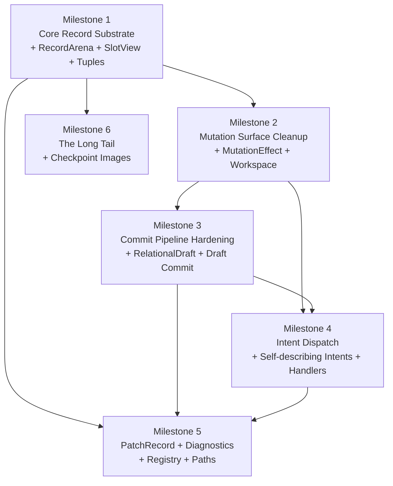

# forge-relational Hardening Spec

> **Scope**: Pre-production breaking refactor. No backward compatibility constraints. Maximize compile-time safety, minimize duplication, align with patterns already proven in `forge-kernel`.
>
> **Methodology**: Full non-test source read (~8,000 LOC across 30+ files). Exact struct definitions, field counts, duplication sites, and line estimates derived from source.

## Recommended Execution Order

The workstreams below were originally grouped by subsystem. For execution, the faster order is:

1. **Core record substrate first**: generic arena, shared slot accessors, and zero-allocation sort keys.
2. **Mutation surface cleanup second**: mutation effect accumulation, borrow-splitting workspace, and config bundling.
3. **Commit pipeline hardening third**: RAII draft semantics and draft-based commit flow after the mutation seam is stable.
4. **Intent modularization fourth**: self-describing intent helpers and handler modules after mutation/commit surfaces stop moving.
5. **Public artifact normalization and polish fifth**: `PatchRecord` cleanup, diagnostics builders, registry cleanup, and path hygiene.
6. **Long-tail reductions last**: checkpoint image generics, enum consolidation, and remaining structural cleanup.

This ordering frontloads the highest-leverage internal duplication cuts without forcing early churn through publication, replay, durability, and facade surfaces.

---

## Table of Contents

1. [Milestone 1: Core Record Substrate](#milestone-1-core-record-substrate) — includes `VersionBound`, branded `SlotView`, `SnapshotGuard`
2. [Milestone 2: Mutation Surface Cleanup](#milestone-2-mutation-surface-cleanup) — includes adjacency deltas as data
3. [Milestone 3: Commit Pipeline Hardening](#milestone-3-commit-pipeline-hardening)
4. [Milestone 4: Intent Dispatch](#milestone-4-intent-dispatch)
5. [Milestone 5: Public Artifact Normalization & Structural Cleanup](#milestone-5-public-artifact-normalization--structural-cleanup)
6. [Milestone 6: The Long Tail](#milestone-6-the-long-tail-extreme-reduction)
7. [Dependency Graph](#dependency-graph)
8. [Precedent Map](#precedent-map)
9. [Deferred Safety Items](./relational_compile_time_safety.md) _(separate document)_

---

## Milestone 1: Core Record Substrate

### 1.1 Problem Statement

`EntityArena` ([state.rs:65–85](file:///Users/spenstar/Documents/programming/forge%20workspace/Forge/crates/forge-relational/src/storage/logic/state.rs#L65-L85)) has **19 `Vec` fields**. `RelationArena` ([state.rs:246–265](file:///Users/spenstar/Documents/programming/forge%20workspace/Forge/crates/forge-relational/src/storage/logic/state.rs#L246-L265)) has **18 `Vec` fields**. They share 16 fields identically. The differences:

| Field                     | `EntityArena`                        | `RelationArena`                       |
| :------------------------ | :----------------------------------- | :------------------------------------ |
| `metadata_history`        | `Vec<Vec<VersionedEntityMetadata>>`  | `Vec<Vec<VersionedRelationMetadata>>` |
| `structural_fingerprints` | `Vec<Option<StructuralFingerprint>>` | _(absent)_                            |
| `lineage_ids`             | `Vec<Option<LineageId>>`             | _(absent)_                            |
| `endpoints`               | _(absent)_                           | `Vec<Option<RelationEndpoints>>`      |

Every method on these structs — `with_capacity`, `reserve_additional`, `allocate`, `retire`, `lifecycle_counts`, `apply_payload_update` — is duplicated verbatim except for the metadata type and the extra/missing fields.

Beyond the structs themselves, **22 function pairs** across 12 files duplicate logic between entity and relation codepaths, totaling **~865 lines** of near-identical code. Full enumeration:

<details>
<summary>Click to expand: all 22 duplicated function pairs</summary>

| #   | Entity Function                                    | Relation Function                                   | File                                                                                                                                                          | ~Lines |
| :-- | :------------------------------------------------- | :-------------------------------------------------- | :------------------------------------------------------------------------------------------------------------------------------------------------------------ | :----- |
| 1   | `EntityArena` struct + 5 methods                   | `RelationArena` struct + 5 methods                  | [state.rs](file:///Users/spenstar/Documents/programming/forge%20workspace/Forge/crates/forge-relational/src/storage/logic/state.rs)                           | 200    |
| 2   | `allocate_entity`                                  | `allocate_relation`                                 | [apply_mutation.rs](file:///Users/spenstar/Documents/programming/forge%20workspace/Forge/crates/forge-relational/src/logic/runtime/apply_mutation.rs)         | 40     |
| 3   | `ensure_entity_target_is_current`                  | `ensure_relation_target_is_current`                 | [guards.rs](file:///Users/spenstar/Documents/programming/forge%20workspace/Forge/crates/forge-relational/src/logic/runtime/apply/guards.rs)                   | 20     |
| 4   | `write_entity_aspect_versions`                     | `write_relation_aspect_versions`                    | [aspects.rs](file:///Users/spenstar/Documents/programming/forge%20workspace/Forge/crates/forge-relational/src/logic/runtime/apply/aspects.rs)                 | 15     |
| 5   | `entity_exists_in_state`                           | `relation_exists_in_state`                          | [merge.rs](file:///Users/spenstar/Documents/programming/forge%20workspace/Forge/crates/forge-relational/src/logic/runtime/merge.rs)                           | 15     |
| 6   | `entity_key`                                       | `relation_key`                                      | [merge.rs](file:///Users/spenstar/Documents/programming/forge%20workspace/Forge/crates/forge-relational/src/logic/runtime/merge.rs)                           | 10     |
| 7   | `materialize_current_entity_record`                | `materialize_current_relation_record`               | [read.rs](file:///Users/spenstar/Documents/programming/forge%20workspace/Forge/crates/forge-relational/src/snapshots/logic/read.rs)                           | 40     |
| 8   | `materialize_entity_record_at_version`             | `materialize_relation_record_at_version`            | [read.rs](file:///Users/spenstar/Documents/programming/forge%20workspace/Forge/crates/forge-relational/src/snapshots/logic/read.rs)                           | 40     |
| 9   | `visible_entities_from_state`                      | `visible_relations_from_state`                      | [read.rs](file:///Users/spenstar/Documents/programming/forge%20workspace/Forge/crates/forge-relational/src/snapshots/logic/read.rs)                           | 20     |
| 10  | `visible_entities_of_kind_in_partition_from_state` | `visible_relations_of_kind_in_partition_from_state` | [read.rs](file:///Users/spenstar/Documents/programming/forge%20workspace/Forge/crates/forge-relational/src/snapshots/logic/read.rs)                           | 40     |
| 11  | `pin_entity`                                       | `pin_relation`                                      | [lifecycle.rs](file:///Users/spenstar/Documents/programming/forge%20workspace/Forge/crates/forge-relational/src/snapshots/logic/lifecycle.rs)                 | 40     |
| 12  | `unpin_entity`                                     | `unpin_relation`                                    | [lifecycle.rs](file:///Users/spenstar/Documents/programming/forge%20workspace/Forge/crates/forge-relational/src/snapshots/logic/lifecycle.rs)                 | 40     |
| 13  | `pin_branch_entity` / `unpin_branch_entity`        | `pin_branch_relation` / `unpin_branch_relation`     | [lifecycle.rs](file:///Users/spenstar/Documents/programming/forge%20workspace/Forge/crates/forge-relational/src/snapshots/logic/lifecycle.rs)                 | 30     |
| 14  | `adjust_entity_pin`                                | `adjust_relation_pin`                               | [lifecycle.rs](file:///Users/spenstar/Documents/programming/forge%20workspace/Forge/crates/forge-relational/src/snapshots/logic/lifecycle.rs#L1000-L1096)     | 50     |
| 15  | `refresh_entity_retention_state`                   | `refresh_relation_retention_state`                  | [lifecycle.rs](file:///Users/spenstar/Documents/programming/forge%20workspace/Forge/crates/forge-relational/src/snapshots/logic/lifecycle.rs#L816-L894)       | 40     |
| 16  | Entity reclaim loop (lines 160–210)                | Relation reclaim loop (lines 217–266)               | [retention.rs](file:///Users/spenstar/Documents/programming/forge%20workspace/Forge/crates/forge-relational/src/storage/logic/retention.rs)                   | 60     |
| 17  | Entity retention inspect (lines 24–61)             | Relation retention inspect (lines 63–99)            | [retention.rs](file:///Users/spenstar/Documents/programming/forge%20workspace/Forge/crates/forge-relational/src/storage/logic/retention.rs)                   | 40     |
| 18  | Entity trim history (lines 922–955)                | Relation trim history (lines 957–990)               | [lifecycle.rs](file:///Users/spenstar/Documents/programming/forge%20workspace/Forge/crates/forge-relational/src/snapshots/logic/lifecycle.rs)                 | 40     |
| 19  | `entity_aspect_versions`                           | `relation_aspect_versions`                          | [introspection.rs](file:///Users/spenstar/Documents/programming/forge%20workspace/Forge/crates/forge-relational/src/storage/logic/introspection.rs#L201-L237) | 20     |
| 20  | `entity_aspects_at_version`                        | `relation_aspects_at_version`                       | [introspection.rs](file:///Users/spenstar/Documents/programming/forge%20workspace/Forge/crates/forge-relational/src/storage/logic/introspection.rs#L239-L263) | 15     |
| 21  | `summarize_entity_chunks`                          | `summarize_relation_chunks`                         | [chunks.rs](file:///Users/spenstar/Documents/programming/forge%20workspace/Forge/crates/forge-relational/src/storage/logic/chunks.rs)                         | 30     |
| 22  | `LiveEntityRequiresKind`                           | `LiveRelationRequiresEndpoints`                     | [rules.rs](file:///Users/spenstar/Documents/programming/forge%20workspace/Forge/crates/forge-relational/src/validation/logic/rules.rs)                        | 20     |

</details>

### 1.2 Exact Type Definitions

#### `RecordId` trait

```rust
pub(crate) trait RecordId: Copy + Ord + Hash + Debug + 'static {
    fn partition_id(&self) -> PartitionId;
    fn local_slot(&self) -> usize;           // replaces `.local_slot.0 as usize` everywhere
    fn generation(&self) -> u32;             // replaces `.generation.0` everywhere
    fn with_slot_and_generation(partition: PartitionId, slot: u64, gen: u32) -> Self;
}

impl RecordId for EntityId {
    fn partition_id(&self) -> PartitionId { self.partition_id }
    fn local_slot(&self) -> usize { self.local_slot.0 as usize }
    fn generation(&self) -> u32 { self.generation.0 }
    fn with_slot_and_generation(partition: PartitionId, slot: u64, gen: u32) -> Self {
        EntityId { partition_id: partition, local_slot: LocalSlot(slot), generation: Generation(gen) }
    }
}
// Identical impl for RelationId
```

#### `RecordKind` trait

```rust
pub(crate) trait RecordKind: 'static {
    type Id: RecordId;
    type Extra: Default + Clone + Debug;      // () for Entity, Option<RelationEndpoints> for Relation
    type Meta: Clone + Debug;                 // VersionedEntityMetadata / VersionedRelationMetadata
    type ReadRecord: Debug + PartialEq;       // EntityReadRecord / RelationReadRecord

    fn arena(partition: &PartitionState) -> &RecordArena<Self>;
    fn arena_mut(partition: &mut PartitionState) -> &mut RecordArena<Self>;

    /// Build metadata for a new allocation. Called inside RecordArena::allocate.
    fn build_metadata(kind_id: KindId, generation: u32, version_id: VersionId, extra: &Self::Extra) -> Self::Meta;

    /// Build a readable record from slot data. Called inside materialize.
    fn build_read_record(
        id: Self::Id,
        kind_id: Option<KindId>,
        payload: Option<RecordPayload>,
        lifecycle: RecordLifecycleState,
        created_at: VersionId,
        extra: &Self::Extra,
    ) -> Self::ReadRecord;
}
```

#### `RecordArena<K>`

```rust
#[derive(Debug, Clone)]
pub(crate) struct RecordArena<K: RecordKind> {
    // ── Identity ──
    pub(crate) partition_ids: Vec<PartitionId>,
    pub(crate) generations: Vec<u32>,

    // ── Lifecycle ──
    pub(crate) lifecycle: Vec<RecordLifecycleState>,
    pub(crate) created_at: Vec<VersionId>,
    pub(crate) retired_at: Vec<Option<VersionId>>,
    pub(crate) live_bitset: DenseSlotBitSet,
    pub(crate) reclaimable_bitset: DenseSlotBitSet,
    pub(crate) free_list: Vec<u64>,

    // ── Data ──
    pub(crate) kind_ids: Vec<Option<KindId>>,
    pub(crate) payloads: Vec<Option<RecordPayload>>,
    pub(crate) payload_history: Vec<Vec<VersionedPayload>>,
    pub(crate) metadata_history: Vec<Vec<K::Meta>>,
    pub(crate) aspect_versions: Vec<BTreeMap<Symbol, u64>>,
    pub(crate) diagnostics_enrichment: Vec<BTreeMap<Symbol, String>>,

    // ── Retention pins ──
    pub(crate) snapshot_pins: Vec<u32>,
    pub(crate) branch_pins: Vec<u32>,
    pub(crate) replay_pins: Vec<u32>,

    // ── Kind-specific extra (endpoints for relations, fingerprints+lineage for entities) ──
    pub(crate) extra: Vec<K::Extra>,
}
```

#### `SlotView` accessor (branded lifetime)

> [!NOTE]
> **Why the `'arena` lifetime matters (Generative Lifetime Branding)**
>
> A `SlotView` is a "cursor" pointing into a specific arena at a specific slot. Without the `'arena` lifetime, you could store a `SlotView`, mutate or reallocate the arena, and then read from the stale cursor — accessing garbage memory or a completely different record.
>
> The `'arena` lifetime brands the `SlotView` to the borrow of the arena that created it. The Rust compiler statically proves that no `SlotView` can outlive its source arena borrow, and no arena mutation can happen while any `SlotView` exists. This eliminates **phantom reads** and **double-free slot access** — two of the most devastating rare bugs in generational arena systems — at zero runtime cost.

```rust
pub(crate) struct SlotView<'arena, K: RecordKind> {
    arena: &'arena RecordArena<K>,
    index: usize,
}

impl<K: RecordKind> SlotView<'_, K> {
    pub fn generation(&self) -> u32 { self.arena.generations[self.index] }
    pub fn lifecycle(&self) -> RecordLifecycleState { self.arena.lifecycle[self.index] }
    pub fn is_live(&self) -> bool { self.lifecycle() == RecordLifecycleState::Live }
    pub fn kind_id(&self) -> Option<KindId> { self.arena.kind_ids[self.index] }
    pub fn payload(&self) -> Option<&RecordPayload> { self.arena.payloads[self.index].as_ref() }
    pub fn retired_at(&self) -> Option<VersionId> { self.arena.retired_at[self.index] }
    pub fn extra(&self) -> &K::Extra { &self.arena.extra[self.index] }
    pub fn snapshot_pins(&self) -> u32 { self.arena.snapshot_pins[self.index] }
    pub fn branch_pins(&self) -> u32 { self.arena.branch_pins[self.index] }
    pub fn replay_pins(&self) -> u32 { self.arena.replay_pins[self.index] }

    /// Validates that the given ID still refers to the record at this slot.
    /// The generation check prevents ABA-style hazards where a slot was
    /// freed and reallocated to a completely different record.
    pub fn is_current(&self, id: &K::Id) -> bool {
        self.generation() == id.generation() && self.is_live()
    }

    /// Version-visible read: checks whether this record is visible at the
    /// given version boundary. Uses `VersionBound` (see §1.6) to prevent
    /// fencepost errors in visibility logic.
    pub fn is_visible_at(&self, bound: VersionBound) -> bool {
        bound.includes_created(self.arena.created_at[self.index])
            && self.arena.retired_at[self.index]
                .map_or(true, |retired| bound.retains_retired(retired))
    }
}
```

### 1.3 Entity `Extra` Type

`EntityArena` has two fields that `RelationArena` doesn't: `structural_fingerprints` and `lineage_ids`. These become the `Extra`:

```rust
#[derive(Debug, Clone, Default)]
pub(crate) struct EntityExtra {
    pub(crate) structural_fingerprint: Option<StructuralFingerprint>,
    pub(crate) lineage_id: Option<LineageId>,
}

// Relation's Extra is just endpoints:
pub(crate) type RelationExtra = Option<RelationEndpoints>;
```

### 1.6 `VersionBound` — Fencepost Elimination

> [!NOTE]
> **Why a newtype instead of raw comparison (Single Decision Point)**
>
> The most common off-by-one bug in MVCC systems is the "fencepost error": should a record retired _at_ version V5 be visible to a reader pinned at V5? The answer depends on whether you use `<` or `<=`, and the decision is currently made independently at every call site using raw `VersionId` comparisons.
>
> `VersionBound` centralizes this decision into exactly two methods. Then `VersionId` itself does **not** implement `PartialOrd`, so the raw comparison operators `<` and `<=` are physically unavailable. Every visibility check in the codebase must go through `VersionBound`, making it impossible to accidentally use the wrong comparison.

```rust
/// The single source of truth for "is this version visible at this boundary?"
/// VersionId intentionally does NOT implement PartialOrd — all comparisons
/// go through this type to prevent fencepost bugs.
#[derive(Debug, Clone, Copy, PartialEq, Eq)]
pub struct VersionBound(VersionId);

impl VersionBound {
    pub fn new(version: VersionId) -> Self { Self(version) }

    /// A record created at `created_at` is visible if it was created at or
    /// before this boundary.
    pub fn includes_created(&self, created_at: VersionId) -> bool {
        created_at.0 <= self.0.0
    }

    /// A record retired at `retired_at` is still visible if it was retired
    /// strictly after this boundary (it was alive at this version).
    pub fn retains_retired(&self, retired_at: VersionId) -> bool {
        retired_at.0 > self.0.0
    }
}
```

**Impact**: Replaces ~15 scattered raw comparisons across `read.rs`, `lifecycle.rs`, `retention.rs`, and `introspection.rs` with calls to `VersionBound::includes_created` / `retains_retired`.

### 1.7 `SnapshotGuard` — RAII Snapshot Pinning

> [!NOTE]
> **Why RAII instead of manual pin/unpin (Resource Leak Prevention)**
>
> The current API returns a raw `SnapshotId` from `pin_snapshot()`. If any code path — including panics, early returns via `?`, or forgotten cleanup — fails to call `unpin_snapshot()`, the snapshot is permanently pinned. The retention system can never reclaim records visible at that version, causing unbounded memory growth.
>
> `SnapshotGuard` uses Rust's `Drop` trait to automatically unpin when the guard goes out of scope. It is physically impossible to leak a pin, even under panic. This is the same pattern as `MutexGuard`, `File` handles, and the `ScratchGuard` pattern in `forge-signal`.

```rust
/// RAII guard that automatically unpins a snapshot when dropped.
/// The `'runtime` lifetime prevents the guard from outliving the runtime.
pub struct SnapshotGuard<'runtime> {
    runtime: &'runtime mut RelationalRuntime,
    snapshot_id: SnapshotId,
}

impl<'runtime> SnapshotGuard<'runtime> {
    pub fn snapshot_id(&self) -> SnapshotId { self.snapshot_id }

    /// Access the snapshot for reading.
    pub fn read(&self) -> SnapshotReader<'_> {
        self.runtime.snapshot_reader(self.snapshot_id)
    }
}

impl Drop for SnapshotGuard<'_> {
    fn drop(&mut self) {
        // Automatically unpin. Even panics trigger Drop.
        self.runtime.unpin_snapshot(self.snapshot_id);
    }
}

impl RelationalRuntime {
    /// Pin a snapshot and return a guard that auto-unpins on drop.
    pub fn pin_snapshot(&mut self, version: VersionId) -> SnapshotGuard<'_> {
        let id = self.pin_snapshot_inner(version);
        SnapshotGuard { runtime: self, snapshot_id: id }
    }
}
```

**Impact**: Replaces all manual `pin_snapshot`/`unpin_snapshot` pairs in `lifecycle.rs` and downstream consumers.

### 1.8 Sort Key Fix

**Current** ([merge.rs](file:///Users/spenstar/Documents/programming/forge%20workspace/Forge/crates/forge-relational/src/logic/runtime/merge.rs)):

```rust
fn entity_key(entity_id: EntityId) -> String {
    format!("{:08}:{:020}:{:010}", partition_id.0, local_slot.0, generation.0)
}
```

**After** (generic, zero-allocation):

```rust
fn record_key<K: RecordKind>(id: K::Id) -> (u32, usize, u32) {
    (id.partition_id().0, id.local_slot(), id.generation())
}
```

Tuples implement `Ord` via lexicographic comparison automatically.

### 1.9 Files Modified

| File                                              | Change                                                                                        |
| :------------------------------------------------ | :-------------------------------------------------------------------------------------------- |
| `storage/substrate/record_arena.rs`               | Replace `EntityArena` + `RelationArena` with `RecordArena<K>`. Add `SlotView`.               |
| `storage/partition/adjacency.rs`                  | No change (adjacency is entity-specific, stays on `PartitionState`).                          |
| `storage/overlay/partition.rs`                    | `PartitionState` holds `RecordArena<EntityKind>` + `RecordArena<RelationKind>`.               |
| `visibility/retention/reclaim.rs`                 | Replace dual entity/relation loops with single generic reclaim helpers.                       |
| `visibility/materialization/aspect_introspection.rs` | Merge duplicated aspect introspection helpers onto the generic substrate.                   |
| `storage/partition/chunks.rs`                     | Merge `summarize_entity_chunks`/`summarize_relation_chunks` into one generic.                 |
| `authority/mutation/record_changes.rs`            | Merge `allocate_entity`/`allocate_relation` into `allocate_record::<K>()`.                    |
| `authority/mutation/stale_targets.rs`             | Merge 2 functions into `ensure_target_is_current::<K>()`.                                     |
| `authority/mutation/aspect_versions.rs`           | Merge 2 functions into `write_aspect_versions::<K>()`.                                        |
| `authority/merge/canonical_keys.rs`               | Canonical intent ordering after generic record identity cleanup.                               |
| `authority/merge/record_lookup.rs`                | Shared entity/relation existence checks on the generic substrate.                              |
| `visibility/materialization/read_records.rs`      | Merge 8 functions into 4 generics.                                                            |
| `visibility/pins/*`                               | Merge `pin_entity`/`pin_relation`, `unpin_entity`/`unpin_relation`, all adjust/refresh pairs. |
| `validation/logic/rules.rs`                       | Merge duplicated invariant logic.                                                             |

---

## Milestone 2: Mutation Surface Cleanup

This milestone intentionally stops at the mutation seam. It does **not** include the RAII draft or full commit rewrite; those move to Milestone 3 so the commit refactor lands after the mutation APIs stabilize.

### 2.1 Mutation Effect Envelope (modeled on `OperationResult<T>`)

**Precedent**: [OperationResult\<T\>](file:///Users/spenstar/Documents/programming/forge%20workspace/Forge/crates/forge-core/src/envelope/data/operation_result.rs#L29-L58) wraps a primary return value alongside warnings, metrics, decision logs, and lineage deltas. Callers call `accumulate()` to merge child results into parent envelopes.

**Current problem**: `apply_entity_intent` takes 10 parameters including `&mut Vec<RecordRef>`, `&mut Vec<PatchRecord>`, `&mut Vec<RelationalDiagnosticsEntry>`. Adding any new output type (e.g., lineage events) means updating the signature of **every mutation function in the chain**.

```rust
/// Returned by every mutation handler. Caller accumulates into parent.
#[derive(Debug, Default)]
pub(crate) struct MutationEffect {
    pub changed_records: Vec<RecordRef>,
    pub patch_records: Vec<PatchRecord>,
    pub diagnostics: Vec<RelationalDiagnosticsEntry>,
    /// Adjacency changes produced by this mutation. Applied centrally
    /// by the commit pipeline — see §2.5.
    pub adjacency_deltas: Vec<AdjacencyDelta>,
}

impl MutationEffect {
    pub fn accumulate(&mut self, child: MutationEffect) {
        self.changed_records.extend(child.changed_records);
        self.patch_records.extend(child.patch_records);
        self.diagnostics.extend(child.diagnostics);
        self.adjacency_deltas.extend(child.adjacency_deltas);
    }
}
```

### 2.2 Borrow-Splitting Workspace

`MutationWorkspace` is now a narrow split-borrow context, not a parameter bag and not a wide tuple escape hatch. The important rule is: expose only the borrow combinations the mutation layer actually needs.

```rust
pub(crate) struct MutationWorkspace<'a> {
    pub draft: &'a mut RelationalDraft,
    pub symbols: &'a mut StringInterner,
    pub config: &'a MutationConfig,         // bundles cascade_delete, patch_surface_policy, etc.
    pub schema: &'a RelationalSchemaRegistry,
    pub version_id: VersionId,
}

impl MutationWorkspace<'_> {
    pub fn draft_and_symbols_mut(&mut self)
        -> (&mut RelationalDraft, &mut StringInterner) { ... }

    pub fn draft_and_schema(&mut self)
        -> (&mut RelationalDraft, &RelationalSchemaRegistry) { ... }

    pub fn draft_symbols_and_schema(&mut self)
        -> (&mut RelationalDraft, &mut StringInterner, &RelationalSchemaRegistry) { ... }
}
```

This keeps leaf handlers explicit about which coupled borrows they really need, while preventing the old `as_parts_mut()` pattern from becoming a permanent all-access escape hatch.

### 2.5 Adjacency Deltas as Return Data

**Problem**: When a cascade delete retires a relation, the adjacency index must be updated. But the relation mutation code and the adjacency index code live in different modules. If a developer writes a new cascade path and forgets the adjacency update, the relation disappears from the arena but its adjacency entry remains — a ghost edge.

**Fix**: Instead of mutation functions directly calling `adjacency.remove_edge()` as a side effect (which is easy to forget), they return adjacency changes as data in `MutationEffect`. The commit pipeline processes them in one place.

```rust
/// Describes an adjacency change that a mutation produced.
/// The commit pipeline applies these centrally — mutation handlers
/// never touch AdjacencyIndex directly.
pub(crate) struct AdjacencyDelta {
    pub relation_id: RelationId,
    pub kind: AdjacencyDeltaKind,
}

pub(crate) enum AdjacencyDeltaKind {
    /// Relation was created — add to adjacency index.
    Created { source: EntityId, target: EntityId },
    /// Relation was deleted — remove from adjacency index.
    Deleted { source: EntityId, target: EntityId },
}
```

The commit pipeline (Milestone 3) applies all deltas after mutation completes:

```rust
// In commit(), after apply_plan() returns effects:
for delta in &effects.adjacency_deltas {
    match delta.kind {
        AdjacencyDeltaKind::Created { source, target } => {
            adjacency.add_edge(delta.relation_id, source, target);
        }
        AdjacencyDeltaKind::Deleted { source, target } => {
            adjacency.remove_edge(delta.relation_id, source, target);
        }
    }
}
```

**Why this works**: Mutation handlers can't forget to update adjacency because they never do it in the first place — they just return the delta. The commit pipeline is the single place where adjacency updates happen, and it processes whatever deltas were returned.

### 2.6 `MutationConfig` (extracted from scattered parameters)

Currently, `patch_surface_policy`, `cascade_delete_policy`, `adjacency_policy`, and `cross_context_policy` are passed as separate parameters or read from `self.config` at different levels. Bundle them:

```rust
pub(crate) struct MutationConfig {
    pub patch_surface_policy: PatchSurfacePolicy,
    pub cascade_delete_policy: CascadeDeletePolicy,
    pub adjacency_policy: AdjacencyPolicy,
    pub cross_context_policy: CrossContextPolicy,
}
```

### 2.7 Files Modified

| File                                  | Change                                                                                                                  |
| :------------------------------------ | :---------------------------------------------------------------------------------------------------------------------- |
| `authority/mutation/record_changes.rs` | Low-level allocation/retire helpers emit `MutationEffect` data instead of writing scattered output vectors.           |
| `authority/mutation/execution.rs`      | Orchestrator. Creates `MutationWorkspace`, calls intent handlers, accumulates.                                        |
| `authority/mutation/intents/*.rs`        | Return `MutationEffect` from per-intent handlers behind a central dispatcher.                                        |
| `config/data/mod.rs`                   | Add `MutationConfig` struct.                                                                                          |

---

## Milestone 3: Commit Pipeline Hardening

This milestone deliberately lands **before** intent modularization. The commit path already has the highest semantic risk, and it becomes easier to simplify once mutation effects and workspace boundaries stop changing.

### 3.1 RAII Draft (modeled on `KernelDraft`)

**Precedent**: [KernelDraft](file:///Users/spenstar/Documents/programming/forge%20workspace/Forge/crates/forge-kernel/src/engine/transaction/logic/draft.rs#L27-L32) stores the original `TopologyState` at construction time. `commit(self)` validates + returns new state. `rollback(self)` returns the original. Drop without commit = implicit rollback.

**The current problem**: `commit()` in `authority/commit/pipeline.rs` mutates a touched-partition draft through a long multi-phase pipeline. The visibility contract is right, but the safety story is still spread across a large function with too many phase-local assumptions.

```rust
/// Owns the pre-mutation partition state. Consuming `commit()` applies mutations.
/// Dropping without `commit()` is a safe no-op (original runtime is untouched).
pub(crate) struct RelationalDraft {
    /// The cloned partition state to mutate speculatively.
    working: BTreeMap<PartitionId, PartitionState>,
    /// Record of touched partitions for targeted re-application.
    touched_partitions: BTreeSet<PartitionId>,
}

impl RelationalDraft {
    /// Snapshot the partitions that this plan will touch.
    pub fn new(
        runtime_partitions: &BTreeMap<PartitionId, PartitionState>,
        touched: &BTreeSet<PartitionId>,
    ) -> Self {
        let working = touched.iter()
            .filter_map(|pid| runtime_partitions.get(pid).map(|p| (*pid, p.clone())))
            .collect();
        Self { working, touched_partitions: touched.clone() }
    }

    pub fn partition(&self, id: PartitionId) -> Option<&PartitionState> { self.working.get(&id) }
    pub fn partition_mut(&mut self, id: PartitionId) -> Option<&mut PartitionState> { self.working.get_mut(&id) }

    /// Consume the draft, returning the mutated partitions for merge into the runtime.
    pub fn commit(self) -> BTreeMap<PartitionId, PartitionState> { self.working }
    // Dropping without calling commit() → partitions are simply discarded. Runtime untouched.
}
```

> [!IMPORTANT]
> **Key difference from `KernelDraft`**: We only clone the _touched_ partitions, not the entire runtime. With large partition sets, cloning everything would be expensive. The touched-partition planner now lives alongside commit planning in `authority/commit/*` and scopes the draft snapshot.

### 3.2 Draft-Based Commit

With `RelationalDraft` and the stabilized mutation seam from Milestone 2, `commit()` becomes a thin orchestrator over named phases. The important architectural rule is: phase-local mechanics live under `authority/commit/phases/*`, while `pipeline.rs` sequences them.

```rust
pub fn commit(&mut self, tx: RelationalTransaction) -> Result<CommitOutcome, TransactionCommitError> {
    let prepared = phases::prepare::prepare_draft_scope(&mut tx)?;
    phases::prepare::record_preparation_counters(...);
    phases::invariants::run_commit_boundary_invariants(...)?;

    let effect = apply_plan_to_draft(...)?;
    phases::prepare::record_mutation_counters(...);
    phases::invariants::run_mutation_sensitive_invariants(...)?;

    let history = phases::history::resolve_commit_history(...)?;
    let patch = assemble_patch(...);
    phases::publication::enforce_patch_budget(...)?;
    phases::invariants::run_snapshot_publication_invariants(...)?;

    let artifacts = runtime.assemble_publication_bundle(...);
    let envelope = phases::publication::canonical_commit_envelope(...);
    phases::publication::append_durable_commit(...)?;
    phases::finalize::finalize_commit_publication(...);
}
```

If any step before `finalize_commit_publication(...)` returns `Err`, the draft is dropped and live runtime partitions remain untouched.

### 3.3 Files Modified

| File                              | Change                                                                          |
| :-------------------------------- | :------------------------------------------------------------------------------ |
| `storage/overlay/overlay.rs`      | `RelationalDraft` becomes the owning touched-partition mutation state.          |
| `authority/commit/pipeline.rs`    | Phase orchestration only; draft commit no longer owns all helper mechanics.     |
| `authority/commit/phases/prepare.rs` | Draft scope construction and pre-mutation counters.                         |
| `authority/commit/phases/invariants.rs` | Commit-boundary, mutation-sensitive, and publication invariant phases.   |
| `authority/commit/phases/history.rs` | Branch/parent/merge-base resolution and commit-reference assembly.           |
| `authority/commit/phases/publication.rs` | Patch-budget, durable append, changed-record canonicalization, envelope build. |
| `authority/commit/phases/finalize.rs` | Centralized adjacency application and runtime publication/finalization.     |
| `authority/commit/publication.rs` | Patch assembly, diagnostics summary assembly, and post-publication runtime updates. |
| `authority/commit/touched_scope.rs` | Touched-partition planning and adjacency-aware draft scope expansion.        |
| `authority/commit/plan_building.rs` | Planning stays pure and scopes draft/bulk reservation inputs.                 |
| `authority/commit/savepoints.rs`  | Minor: rollback uses draft semantics instead of `WorkingState`.                 |

---

## Milestone 4: Intent Dispatch

This now follows the commit hardening work. The goal is to modularize intent handling once the mutation and commit boundaries have stopped shifting.

### 4.1 Self-Describing Intent Enum

**Current direction**: the public transaction API still accepts `TransactionIntent` as the serialization/input boundary, but authority internals now convert immediately into a typed family:

- `MutationIntent`
- `CreateIntent`
- `EntityMutationIntent`
- `RelationMutationIntent`
- typed bulk/update/delete payload structs

That split removed the need for leaf mutation handlers to receive the umbrella enum directly. Remaining `TransactionIntent` matching is now mostly confined to the facade/input normalization layer and a few explicit merge-key/validation sites.

Before the split, `TransactionIntent` was matched exhaustively in **10+ files**. The highest-signal sites were:

1. `authority/mutation/intents/*.rs` — one handler per intent variant
2. `authority/mutation/intents/dispatch.rs` — central match that routes to the per-intent handler
3. `authority/merge/canonical_keys.rs::canonical_intent_key` — 8-arm match building sort keys
4. `authority/merge/intent_validation.rs::validate_intent` — intent-family validation wiring
5. `authority/merge/conflict_detection.rs::detect_conflicting_updates` — sweeps for conflicting authority
6. `authority/commit/plan_building.rs::normalize_intents_for_merge` — symbol normalization sweeps
7. `authority/commit/touched_scope.rs::touched_partitions_for_plan_set` — extracts touched partition IDs for draft scope
8. `authority/commit/plan_building.rs::bulk_reservations_for_plan` — counts allocations
9. `authority/commit/savepoints.rs` rollback — generates rollback effects
10. [rules.rs `planned_entity_field_values`](file:///Users/spenstar/Documents/programming/forge%20workspace/Forge/crates/forge-relational/src/validation/logic/rules.rs) — extracts field values

> [!WARNING]
> **Naive trap**: Do NOT replace the serialization boundary with `Box<dyn MutationAction>`. The durable log still needs a concrete serializable intent shape. `TransactionIntent` stays as the external/log boundary; typed intent families are the internal authority model.

**Fix**: keep the public boundary concrete, but move authority logic onto the typed family and keep only thin input-side helpers on `TransactionIntent`:

```rust
impl TransactionIntent {
    /// Convert the public input intent into the internal typed authority shape.
    pub fn to_mutation_intent(&self) -> MutationIntent { ... }

    /// Input-boundary helpers still live here when they are genuinely shared.
    pub fn collect_raw_client_keys(&self, values: &mut Vec<String>) { ... }
    pub fn normalize_client_keys(&mut self, interner: &mut StringInterner, policy: SymbolPolicy) { ... }
}
```

Adding a new mutation kind should now mean:

1. one new typed intent leaf
2. one new `to_mutation_intent()` arm at the input boundary
3. one new handler module
4. any truly domain-specific merge/validation additions

### 4.2 Bento Box Handler Modules

**Precedent**: [operations/boolean/](file:///Users/spenstar/Documents/programming/forge%20workspace/Forge/crates/forge-kernel/src/operations/boolean/mod.rs) — each operation has `schema.rs` (inputs), `result.rs` (outputs), `contract.rs` (invariants), and `feature.rs` (execution).

```
authority/mutation/intents/
├── create_entity.rs         ← allocate + emit PatchRecord
├── bulk_create_entities.rs  ← loop allocate + emit
├── update_entity.rs         ← guard + apply_payload_update + emit
├── replace_entity.rs        ← guard + retire + allocate + emit
├── delete_entity.rs         ← guard + cascade + retire + emit
├── create_relation.rs       ← validate endpoints + allocate + adjacency + emit
├── bulk_create_relations.rs ← loop
├── delete_relation.rs       ← guard + retire + adjacency remove + emit
├── dispatch.rs              ← single match → handler::apply()
└── mod.rs
```

Each handler now receives only its own typed payload:

```rust
pub(crate) fn apply(
    intent: &DeleteEntityIntent,
    workspace: &mut MutationWorkspace,
) -> Result<MutationEffect, CommitConflict> { ... }
```

The top-level dispatch function:

```rust
pub(crate) fn dispatch_intent(
    intent: &MutationIntent,
    workspace: &mut MutationWorkspace,
) -> Result<MutationEffect, CommitConflict> {
    match intent {
        MutationIntent::Create(CreateIntent::Entity(spec)) => {
            create_entity::apply(spec, workspace)
        }
        MutationIntent::Entity(EntityMutationIntent::Delete(intent)) => {
            delete_entity::apply(intent, workspace)
        }
        // ... one arm per typed family / leaf intent
    }
}
```

### 4.3 `authority/mutation/execution.rs` Simplification

**Current**: `authority/mutation/execution.rs` iterates intents, dispatches across the entity/relation handlers, and accumulates effects.

**After**:

```rust
pub(crate) fn apply_plan(
    plan: &MergedCommitPlan,
    workspace: &mut MutationWorkspace,
) -> Result<MutationEffect, CommitConflict> {
    let mut total = MutationEffect::default();
    for intent in &plan.merged_intents {
        let effect = dispatch_intent(intent, workspace)?;
        total.accumulate(effect);
    }
    Ok(total)
}
```

---

## Milestone 5: Public Artifact Normalization & Structural Cleanup

This milestone now absorbs the `PatchRecord` cleanup that was previously bundled into Milestone 1. That keeps phase one internal and lets the public artifact churn land after core storage, mutation, commit, and intent seams have settled.

### 5.0 `PatchRecord` Fix

**Current** ([diff.rs:72–79](file:///Users/spenstar/Documents/programming/forge%20workspace/Forge/crates/forge-relational/src/publication/data/diff.rs#L72-L79)):

```rust
pub struct PatchRecord {
    pub kind: PatchRecordKind,          // EntityCreated | EntityUpdated | RelationCreated | ...
    pub entity_id: Option<EntityId>,    // Some for entities, None for relations
    pub relation_id: Option<RelationId>,// Some for relations, None for entities
    pub aspects: Vec<AspectKey>,
    pub detail: PatchDetail,
}
```

**After**:

```rust
pub struct PatchRecord {
    pub kind: PatchRecordKind,    // Created | Updated | Deleted | RetainedForAudit
    pub target: RecordRef,        // Entity(EntityId) | Relation(RelationId)
    pub aspects: Vec<AspectKey>,
    pub detail: PatchDetail,
}
```

`PatchRecordKind` drops the entity/relation prefix because `RecordRef` already carries that information:

```rust
pub enum PatchRecordKind { Created, Updated, Deleted, RetainedForAudit }
```

**Downstream impact**: `commit_record_set` in [history/logic/mod.rs:210–221](file:///Users/spenstar/Documents/programming/forge%20workspace/Forge/crates/forge-relational/src/history/logic/mod.rs#L210-L221) currently matches `(record.entity_id, record.relation_id)` with a `_ => None` arm — this becomes a direct `match record.target { ... }`.

### 5.1 Diagnostics Counter Helper

**Current** (25+ occurrences):

```rust
self.instrumentation.complexity_counters.lock()
    .expect("complexity counter lock poisoned").visibility_cache_hits += 1;
```

**After**:

```rust
impl RuntimeInstrumentation {
    pub fn count(&self, f: impl FnOnce(&mut RuntimeComplexityCounters)) {
        f(&mut *self.complexity_counters.lock().expect("complexity counter lock poisoned"));
    }
}
// Usage:
self.instrumentation.count(|c| c.visibility_cache_hits += 1);
```

### 5.2 Diagnostics Builder

**Current** (~15 occurrences):

```rust
self.push_bounded_diagnostic(
    DiagnosticsScope::Transaction,
    DiagnosticsArtifactKind::Failure,
    vec![RelationalDiagnosticsEntry {
        code: DiagnosticCode::StaleHandle,
        message: "entity handle expired".to_string(),
        fields: json!({ "entity_id": id.local_slot.0 }),
    }],
);
```

**After**:

```rust
impl RelationalRuntime {
    fn diagnostic(&mut self, scope: DiagnosticsScope) -> DiagnosticBuilder<'_> { ... }
}
// Usage:
self.diagnostic(DiagnosticsScope::Transaction)
    .failure()
    .entry(DiagnosticCode::StaleHandle, "entity handle expired", json!({ "entity_id": id.local_slot() }))
    .emit();
```

### 5.3 Replay Outcome Factory

**Current**: 7 early-return blocks across [replay/logic/mod.rs](file:///Users/spenstar/Documents/programming/forge%20workspace/Forge/crates/forge-relational/src/replay/logic/mod.rs), each constructing `RelationalReplayOutcome` with 7 fields, 6 of which are identical boilerplate.

**After**:

```rust
impl RelationalReplayOutcome {
    fn fail(request: RelationalReplayRequest, envelope: Option<&CanonicalCommitEnvelope>,
            failure: ReplayFailureClass) -> Self {
        Self {
            requested: request,
            commit: envelope.map(|e| e.commit.clone()),
            reconstructed_parent_chain: envelope.map(|e| e.commit.parents.clone()).unwrap_or_default(),
            snapshot_version: envelope.map(|e| e.commit.version_id),
            compared_surfaces: Vec::new(),
            mismatches: Vec::new(),
            failure: Some(failure),
        }
    }
}
```

### 5.4 `SnapshotRegistry` Interior Mutability Audit

**Current** (`logic/runtime/state.rs` and `logic/runtime/mod.rs`):

```rust
pub(crate) struct SnapshotRegistry {
    pub(crate) visibility_states: Arc<RwLock<BTreeMap<VersionId, SnapshotState>>>,
    pub(crate) visibility_residency: Arc<RwLock<BTreeMap<VersionId, VisibilityResidency>>>,
    pub(crate) recent_policy: Arc<Mutex<DeterministicVersionWindowPolicy>>,
    ...
}
```

`RelationalRuntime` derives `Clone`. Cloning the runtime clones the `Arc`s, giving the clone _shared_ interior-mutable caches with the original. Any code that clones the runtime and expects independent state will silently see cross-instance mutations.

**Fix**: Since we're pre-prod, **remove `Clone` from `RelationalRuntime`**. It's a heavy struct that should never be casually cloned. If scoped snapshots need a "fork," provide an explicit `fork()` method that deep-copies the caches. Then replace shared-ownership cache wrappers with runtime-owned state:

```rust
pub(crate) struct SnapshotRegistry {
    pub(crate) visibility_states: RwLock<BTreeMap<VersionId, SnapshotState>>,
    pub(crate) visibility_residency: RwLock<BTreeMap<VersionId, VisibilityResidency>>,
    pub(crate) recent_policy: Mutex<DeterministicVersionWindowPolicy>,
    ...
}
```

This removes cross-runtime shared cache state while keeping runtime-owned synchronization local to the engine.

### 5.5 Aspect Key Sorting Bug

**Current** (`visibility/materialization/aspect_introspection.rs`):

```rust
aspects.sort_by(|left, right| format!("{left:?}").cmp(&format!("{right:?}")));
```

Sorting `AspectKey` values by their `Debug` representation is fragile, allocates strings on every comparison, and produces inconsistent ordering if the `Debug` format changes. `AspectKey` wraps `InternedString` which should derive `Ord` directly.

**Fix**: Implement `Ord` for `InternedString` and `AspectKey`, then:

```rust
aspects.sort();
aspects.dedup();
```

### 5.6 Module Path Cleanup

**Current**: mutation logic now lives under `authority/mutation/*`, but the remaining cleanup goal is the same: avoid path shims and keep module boundaries real.

```rust
mod execution;
mod record_changes;
```

Hygiene: keep mutation helpers under `authority/mutation/` with a proper `mod.rs`, rather than path shims or flat runtime siblings.

---

## Milestone 6: The Long Tail (Extreme Reduction)

_These are bottom-of-the-barrel structural reductions found during a secondary deep-read of `Durability`, `Query`, and `Validation` modules._

### 6.1 Generic Checkpoint Images

**Current** ([durability/data/mod.rs:102–157](file:///Users/spenstar/Documents/programming/forge%20workspace/Forge/crates/forge-relational/src/Durability/data/mod.rs#L102-L157)): `EntityArenaCheckpointImage` (19 fields) and `RelationArenaCheckpointImage` (18 fields) duplicate the same serialization schema. Then `checkpoint_images.rs` duplicates the tedious `map(|e| ...)` loops to convert between live arenas and images.
**Fix**:

```rust
pub struct RecordArenaCheckpointImage<K: RecordKind> {
    pub generations: Vec<u32>,
    pub lifecycle: Vec<RecordLifecycleState>,
    // ... all shared fields
    pub metadata_history: Vec<Vec<K::MetaImage>>, // Associated types for serialization
    pub extra: Vec<K::ExtraImage>,
}
```

**Impact**: ~150 lines eliminated in `checkpoint_images.rs` + ~40 lines in `data/mod.rs`.

### 6.2 Consolidated `RecordRef` Query Targets

`QueryWorkPacket` now uses `Vec<RecordRef>` directly. The duplicate `ReadTarget` enum is gone, and query planning, packet execution, harness parsing, and tests all match on `RecordRef::{Entity, Relation}`.

### 6.3 Generic Invariants

`InvariantRule` now uses `LiveRecordRequiresSidecar(RecordKindTag)`. The evaluation path shares one generic scan loop over the Phase 1 record substrate instead of duplicating entity/relation sidecar checks.

### 6.4 Flattened Durable Envelopes

Durability now stores raw `CanonicalCommitEnvelope` values in both in-memory log state and segment files. The one-field `DurableCommitEnvelope` wrapper is gone, and recovery/replay/lineage/index consumers use `entry.commit...` directly.

---

## Dependency Graph



---

## Precedent Map

| This Spec                                    | Forge Precedent                 | Source                                                                                                                                              |
| :------------------------------------------- | :------------------------------ | :-------------------------------------------------------------------------------------------------------------------------------------------------- |
| `RecordArena<K>` (generic SoA)               | `TopologyArena`                 | `forge-topo`                                                                                                                                        |
| `RelationalDraft` (RAII commit/rollback)     | `KernelDraft`                   | [draft.rs](file:///Users/spenstar/Documents/programming/forge%20workspace/Forge/crates/forge-kernel/src/engine/transaction/logic/draft.rs)          |
| `MutationEffect` (return-based accumulation) | `OperationResult<T>`            | [operation_result.rs](file:///Users/spenstar/Documents/programming/forge%20workspace/Forge/crates/forge-core/src/envelope/data/operation_result.rs) |
| Focused `MutationWorkspace` split borrows    | `BRepWorkspace` borrow splitting | [workspace.rs](file:///Users/spenstar/Documents/programming/forge%20workspace/Forge/crates/forge-kernel/src/engine/transaction/logic/workspace.rs)  |
| Bento Box intent modules                     | `operations/boolean/`           | [boolean/mod.rs](file:///Users/spenstar/Documents/programming/forge%20workspace/Forge/crates/forge-kernel/src/operations/boolean/mod.rs)            |
| `FeaturePipeline::execute` phases            | `FeaturePipeline`               | [executor.rs](file:///Users/spenstar/Documents/programming/forge%20workspace/Forge/crates/forge-kernel/src/engine/pipeline/executor.rs)             |

---

## Impact Summary

| Milestone | Est. Lines Eliminated | Est. Lines Added | Net        | Bug Classes Eliminated                                                              |
| :-------- | :-------------------- | :--------------- | :--------- | :---------------------------------------------------------------------------------- |
| 1         | ~800                  | ~220             | **−580**   | Forgot-the-relation-side, OOB panics, hot-path string allocs                        |
| 2         | ~150                  | ~100             | **−50**    | Parameter bloat drift, mutation-output shotgun surgery                              |
| 3         | ~290                  | ~80              | **−210**   | Half-applied commit state, rollback/publication phase drift                         |
| 4         | ~300                  | ~150             | **−150**   | Match-explosion maintenance, new-intent shotgun surgery                             |
| 5         | ~170                  | ~90              | **−80**    | Impossible `PatchRecord` states, debug-sorted aspect keys, shared cache via `Clone` |
| 6         | ~250                  | ~40              | **−210**   | Checkpoint desync, redundant enum mapping                                           |
| **Total** | **~1,960**            | **~680**         | **−1,280** |                                                                                     |
